# SailPoint SDK Usage Statistics

<!-- METRICS_START -->
# Usage Statistics
    
Last updated: 3/9/2026, 12:05:32 AM

Below are stats from artifacts tracked across NPM, GitHub, PyPI and PowerShell.
    
### NPM (JavaScript/TypeScript): 

| Package | Downloads | Monthly Downloads | Weekly Downloads | Daily Downloads |
| --- | --- | --- | --- | --- |
| sailpoint-api-client | 24,764 | 2,955 | 946 | 34 |
| **Total** | **24,764** | **2,955** | **946** | **34** | | | | |

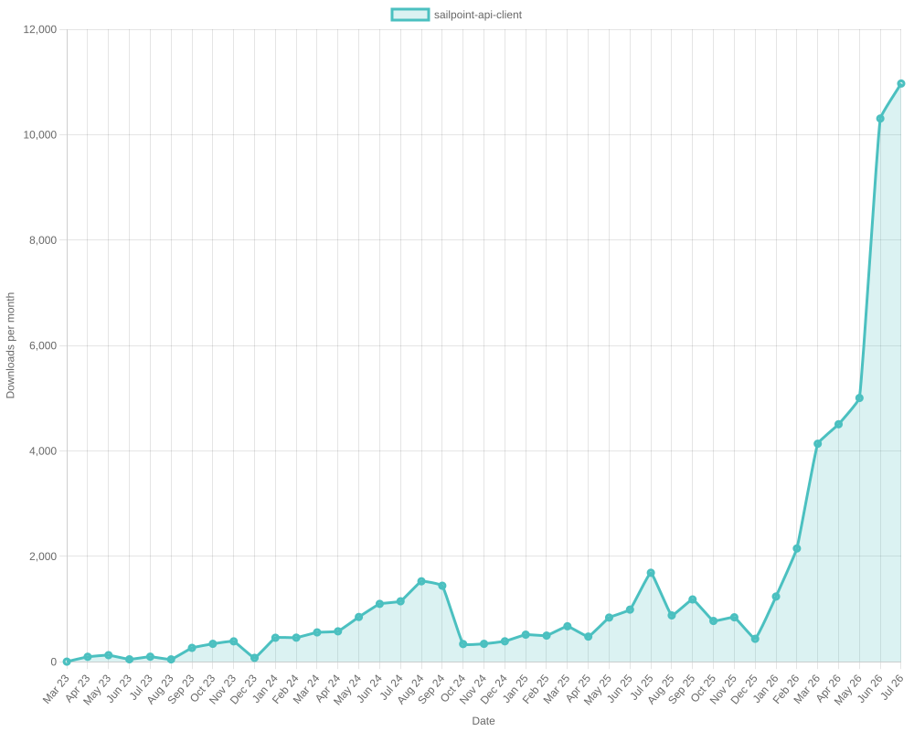
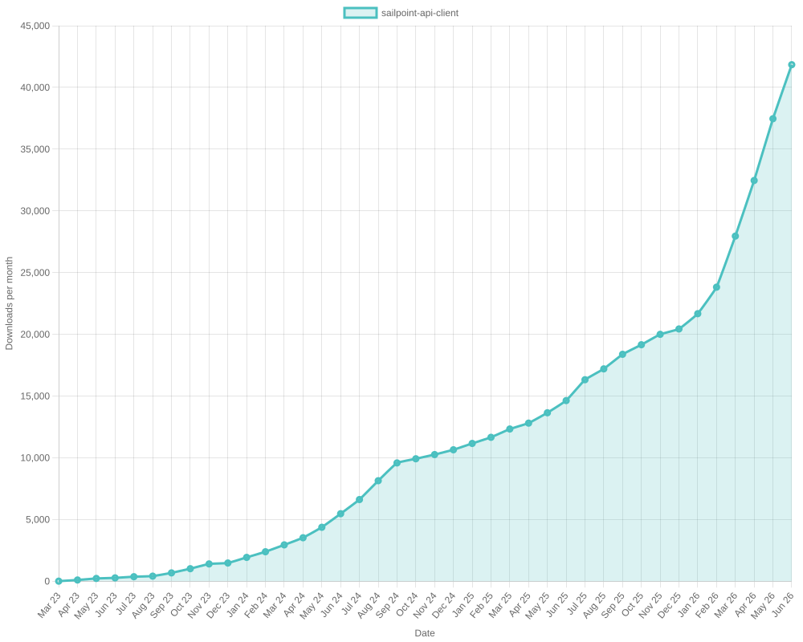

### GitHub: 

| Repository | Stars | Forks | Watchers | Open Issues | Closed Issues | Total Issues | Release Downloads | Releases | Latest Release | Language |
| --- | --- | --- | --- | --- | --- | --- | --- | --- | --- | --- |
| sailpoint-oss/sailpoint-cli | 40 | 29 | 8 | 11 | 35 | 46 | 12,837 | 32 | 2.2.10 | Go |
| sailpoint-oss/api-specs | 15 | 21 | 5 | 16 | 13 | 29 | 0 | 0 | N/A | JavaScript |
| **Total** | **55** | **50** | **13** | **27** | **48** | **75** | **12,837** | **32** | | |

#### Repository Details:

**sailpoint-oss/sailpoint-cli**:
- Last Activity: 19 days ago
- Repository Age: 1,326 days
- Release Count: 32
- Total Release Downloads: 12,837
- Latest Release: 2.2.10
- Latest Release Downloads: 856
- Views: 535
- Unique Visitors: 188
- Clones: 82
- Top Assets (by downloads):
  - sail_windows_amd64_msi: 3,191
  - sail_macos_arm64_tar.gz: 1,926
  - sail_windows_386_zip: 1,481
  - sail_windows_amd64_zip: 1,349
  - sail_linux_amd64_deb: 1,152
- OS Breakdown:
  - windows: 6,729
  - linux: 3,225
  - macos: 2,632
- Arch Breakdown:
  - amd64: 6,864
  - arm64: 2,982
  - 386: 1,949
  - armv6: 351
  - i386: 46
- Format Breakdown:
  - zip: 3,538
  - tar.gz: 3,484
  - msi: 3,191
  - deb: 1,670
  - rpm: 703

**sailpoint-oss/api-specs**:
- Last Activity: 0 days ago
- Repository Age: 1,284 days
- Release Count: 0
- Total Release Downloads: 0
- Latest Release: N/A
- Latest Release Downloads: 0
- Views: 175
- Unique Visitors: 37
- Clones: 415

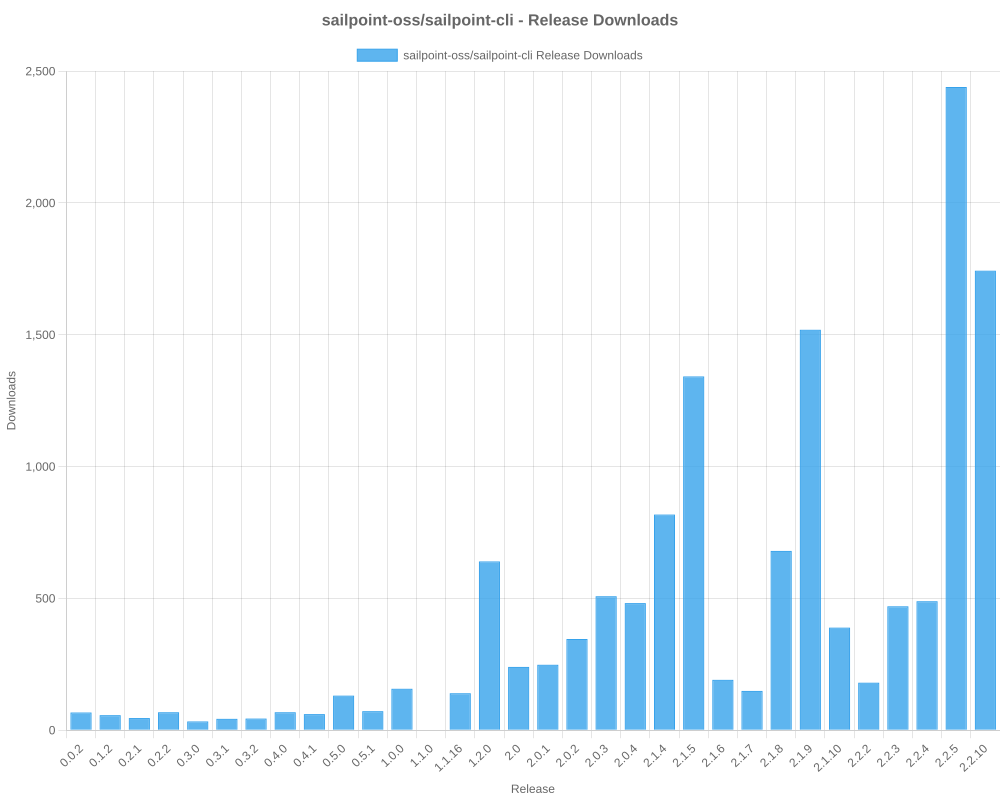
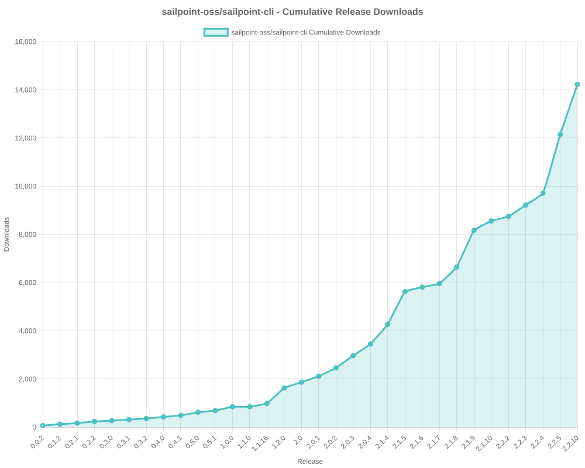
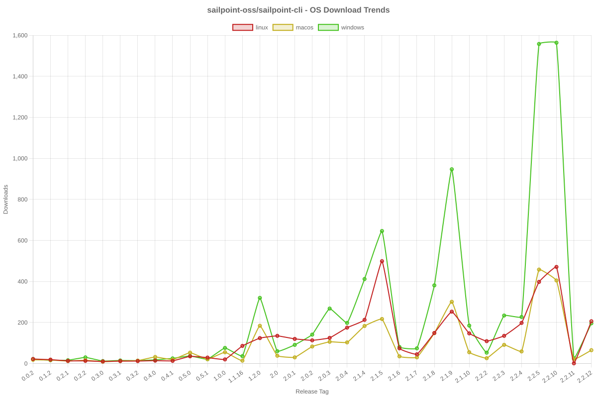
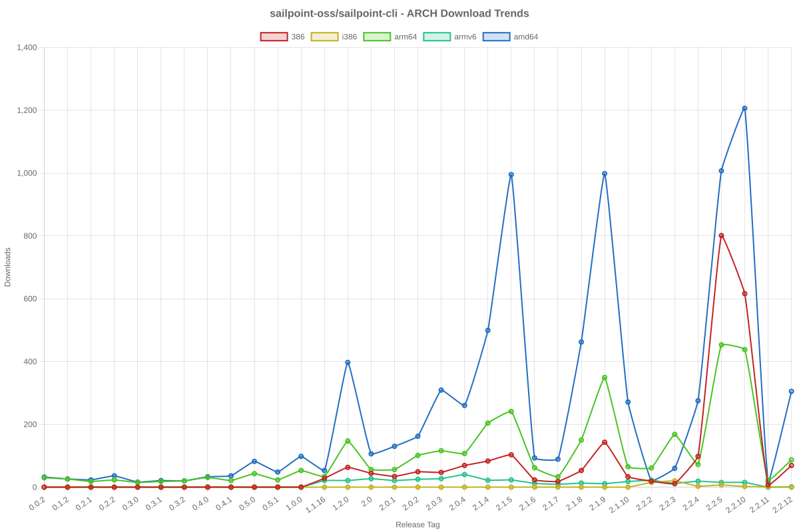
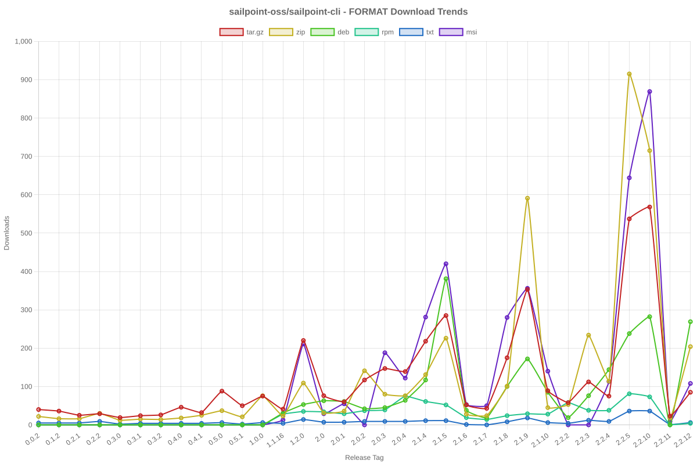

### PyPI (Python): 

| Package | Total Downloads | Monthly Downloads | Weekly Downloads | Daily Downloads | Version |
| --- | --- | --- | --- | --- | --- |
| sailpoint | 0 | 0 | 0 | 0 | N/A |
| **Total** | **0** | **0** | **0** | **0** | | |

#### Package Details:

**sailpoint**:
- Version: N/A
- Releases: 0

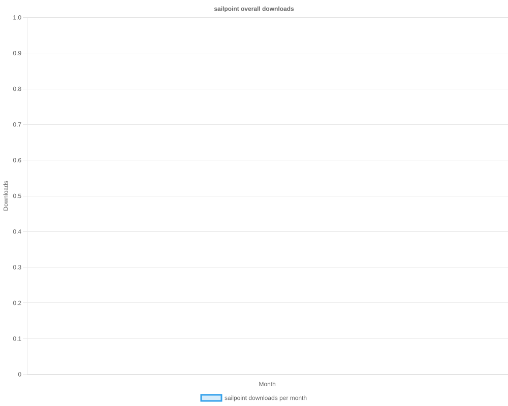
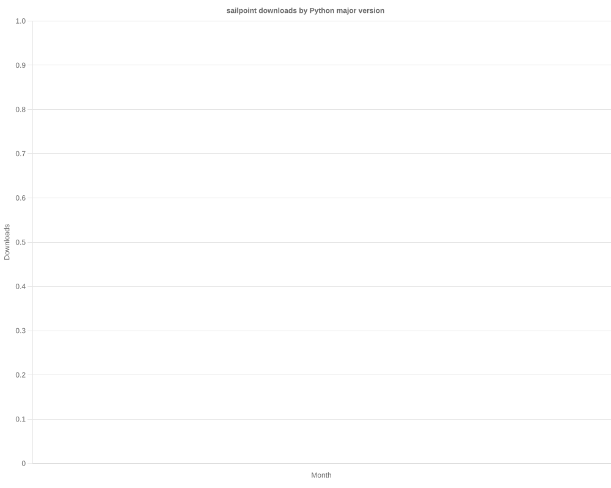

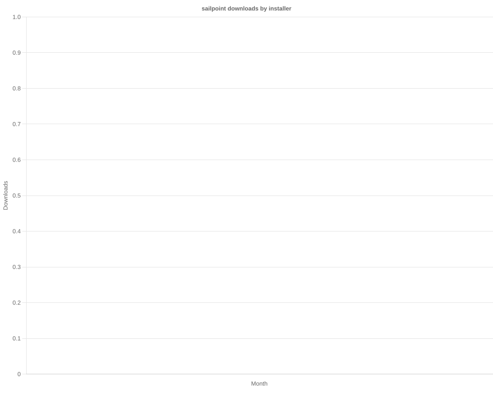

### PowerShell: 

| Module | Total Downloads | Latest Version | Version Downloads | Versions | Last Updated |
| --- | --- | --- | --- | --- | --- |
| PSSailPoint | 26,694 | 1.7.22 | 23 | 50 | 3/5/2026 |
| PSSailpoint.V3 | 17,445 | 1.7.22 | 35 | 39 | 3/5/2026 |
| PSSailpoint.Beta | 17,853 | 1.7.22 | 39 | 39 | 3/5/2026 |
| PSSailpoint.V2024 | 17,379 | 1.7.22 | 34 | 38 | 3/5/2026 |
| PSSailpoint.V2025 | 6,588 | 1.7.22 | 34 | 27 | 3/5/2026 |
| **Total** | **85,959** | | | **193** | |

#### PowerShell Module Details:

**PSSailPoint**:
- Total Downloads: 26,694
- Latest Version: 1.7.22
- Latest Version Downloads: 23
- Version Count: 50
- Last Updated: 3/5/2026
- Package Size: 14404 KB

**PSSailpoint.V3**:
- Total Downloads: 17,445
- Latest Version: 1.7.22
- Latest Version Downloads: 35
- Version Count: 39
- Last Updated: 3/5/2026
- Package Size: 1016 KB

**PSSailpoint.Beta**:
- Total Downloads: 17,853
- Latest Version: 1.7.22
- Latest Version Downloads: 39
- Version Count: 39
- Last Updated: 3/5/2026
- Package Size: 1542 KB

**PSSailpoint.V2024**:
- Total Downloads: 17,379
- Latest Version: 1.7.22
- Latest Version Downloads: 34
- Version Count: 38
- Last Updated: 3/5/2026
- Package Size: 1903 KB

**PSSailpoint.V2025**:
- Total Downloads: 6,588
- Latest Version: 1.7.22
- Latest Version Downloads: 34
- Version Count: 27
- Last Updated: 3/5/2026
- Package Size: 2170 KB

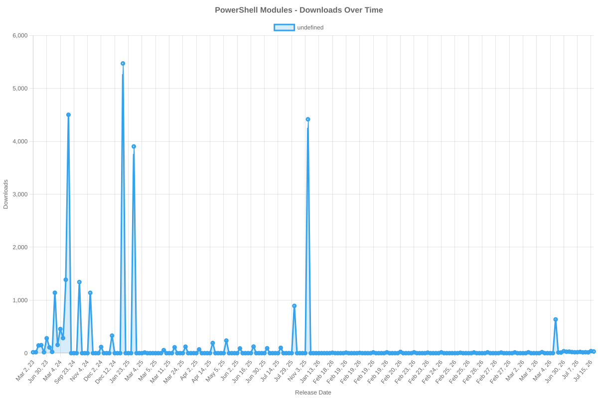
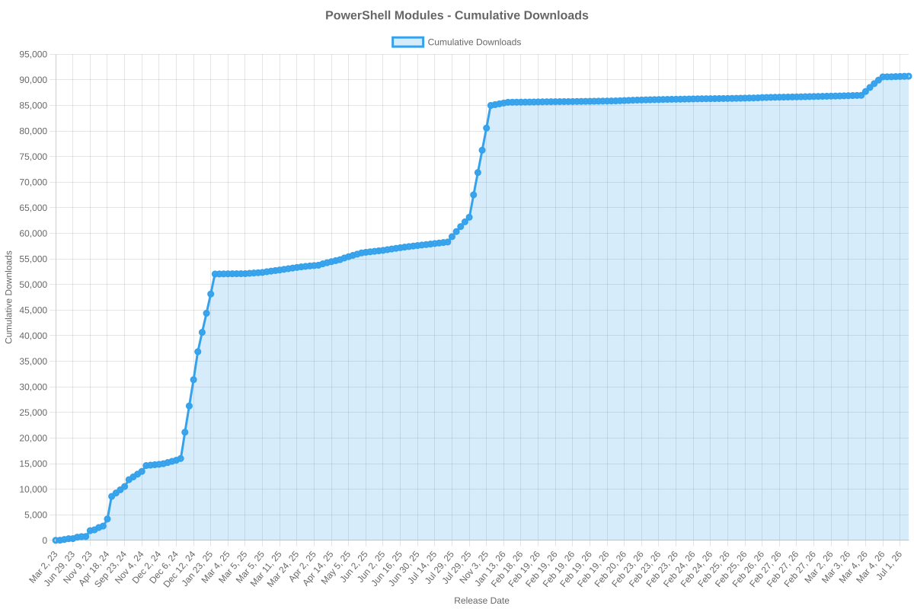

<!-- METRICS_END -->
