# SailPoint SDK Usage Statistics

<!-- METRICS_START -->
# Usage Statistics
    
Last updated: 8/10/2026, 12:07:51 AM

Below are stats from artifacts tracked across NPM, GitHub, PyPI and PowerShell.
    
### NPM (JavaScript/TypeScript): 

| Package | Downloads | Monthly Downloads | Weekly Downloads | Daily Downloads |
| --- | --- | --- | --- | --- |
| sailpoint-api-client | 102,148 | 36,031 | 21,098 | 6,264 |
| **Total** | **102,148** | **36,031** | **21,098** | **6,264** | | | | |

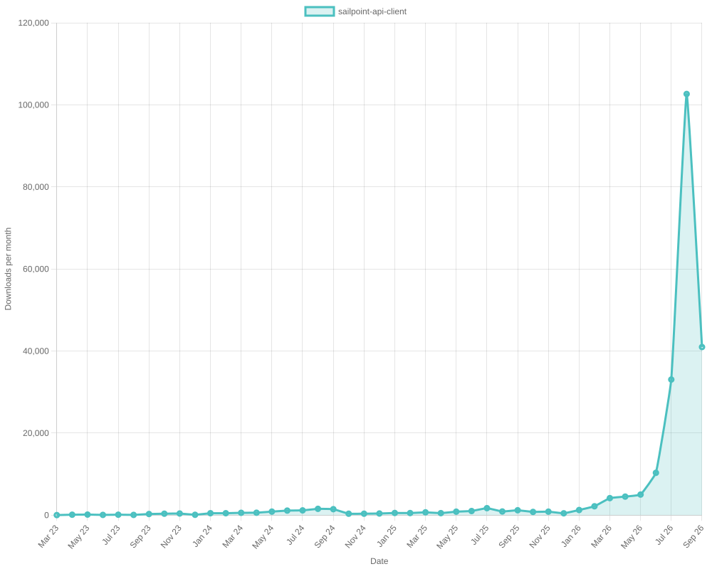
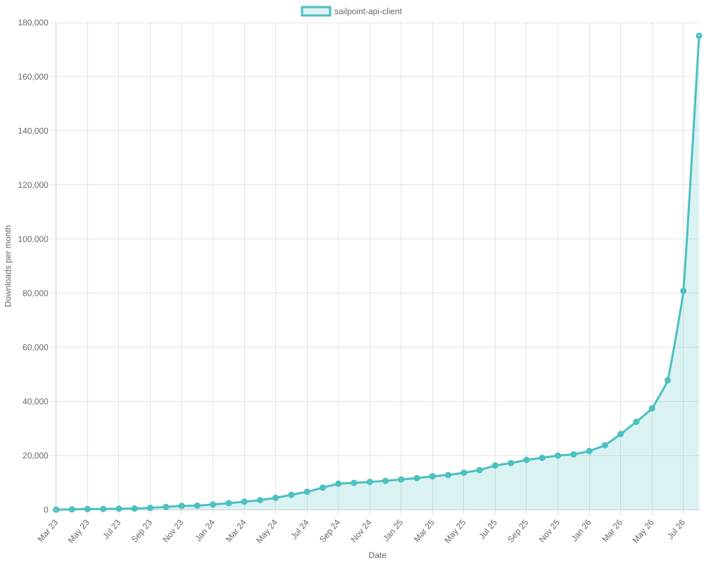

### GitHub: 

| Repository | Stars | Forks | Watchers | Open Issues | Closed Issues | Total Issues | Release Downloads | Releases | Latest Release | Language |
| --- | --- | --- | --- | --- | --- | --- | --- | --- | --- | --- |
| sailpoint-oss/sailpoint-cli | 46 | 34 | 8 | 11 | 36 | 47 | 16,543 | 34 | 2.2.12 | Go |
| sailpoint-oss/api-specs | 18 | 24 | 5 | 19 | 13 | 32 | 0 | 0 | N/A | JavaScript |
| **Total** | **64** | **58** | **13** | **30** | **49** | **79** | **16,543** | **34** | | |

#### Repository Details:

**sailpoint-oss/sailpoint-cli**:
- Last Activity: 2 days ago
- Repository Age: 1,480 days
- Release Count: 34
- Total Release Downloads: 16,543
- Latest Release: 2.2.12
- Latest Release Downloads: 1,302
- Views: 646
- Unique Visitors: 224
- Clones: 2,320
- Top Assets (by downloads):
  - sail_windows_amd64_msi: 4,081
  - sail_linux_amd64_deb: 2,409
  - sail_macos_arm64_tar.gz: 2,346
  - sail_windows_386_zip: 1,896
  - sail_windows_amd64_zip: 1,483
- OS Breakdown:
  - windows: 8,204
  - linux: 4,957
  - macos: 3,085
- Arch Breakdown:
  - amd64: 9,198
  - arm64: 3,550
  - 386: 2,452
  - armv6: 405
  - i386: 51
- Format Breakdown:
  - tar.gz: 4,153
  - zip: 4,123
  - msi: 4,081
  - deb: 3,007
  - rpm: 882

**sailpoint-oss/api-specs**:
- Last Activity: 0 days ago
- Repository Age: 1,438 days
- Release Count: 0
- Total Release Downloads: 0
- Latest Release: N/A
- Latest Release Downloads: 0
- Views: 442
- Unique Visitors: 87
- Clones: 549

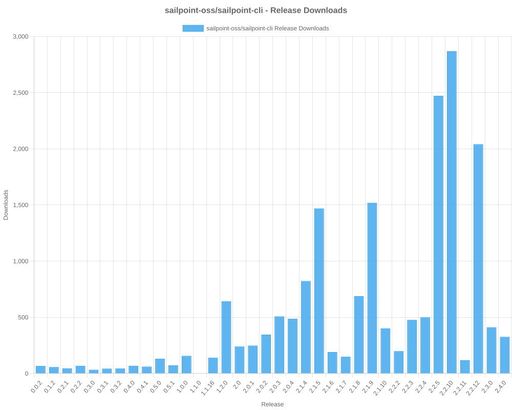
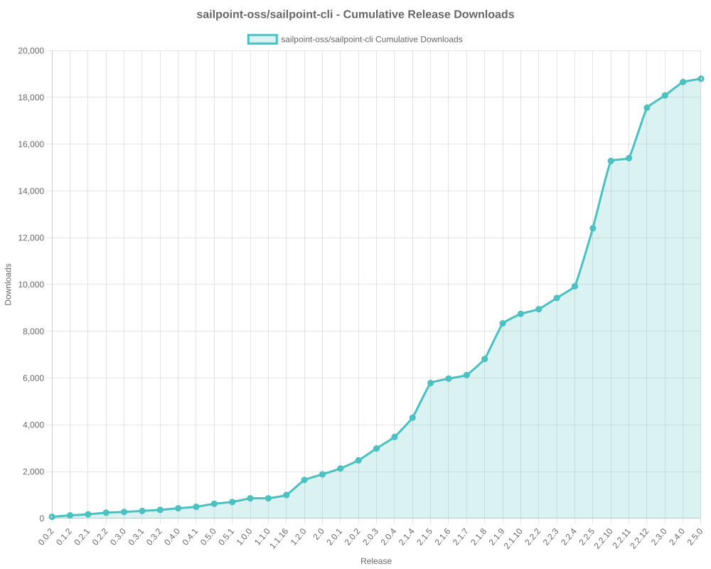
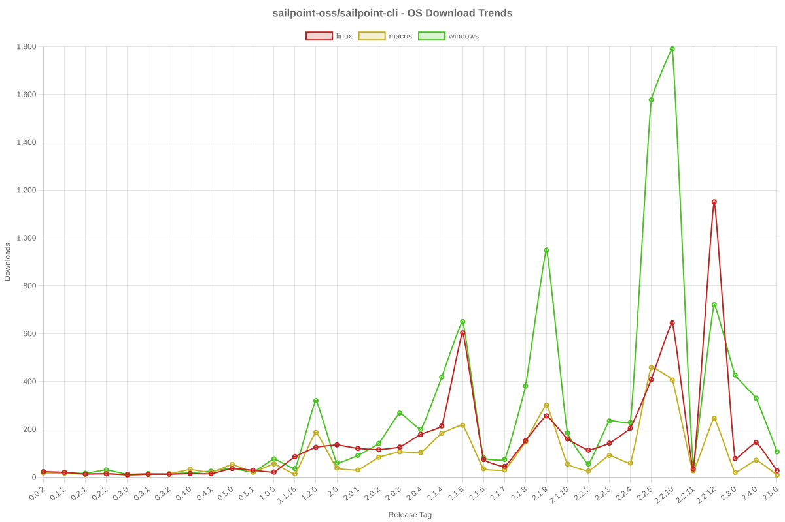
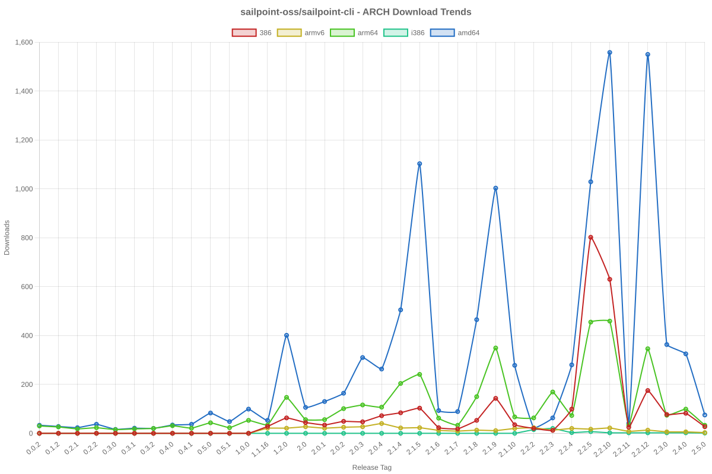
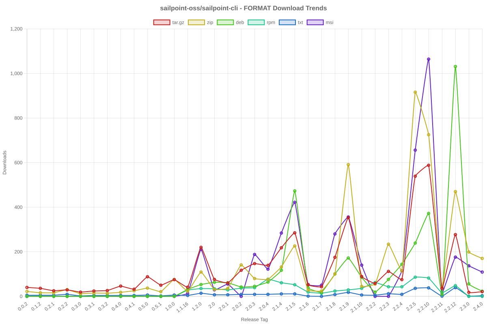

### PyPI (Python): 

| Package | Total Downloads | Monthly Downloads | Weekly Downloads | Daily Downloads | Version |
| --- | --- | --- | --- | --- | --- |
| sailpoint | 0 | 0 | 0 | 0 | N/A |
| **Total** | **0** | **0** | **0** | **0** | | |

#### Package Details:

**sailpoint**:
- Version: N/A
- Releases: 0

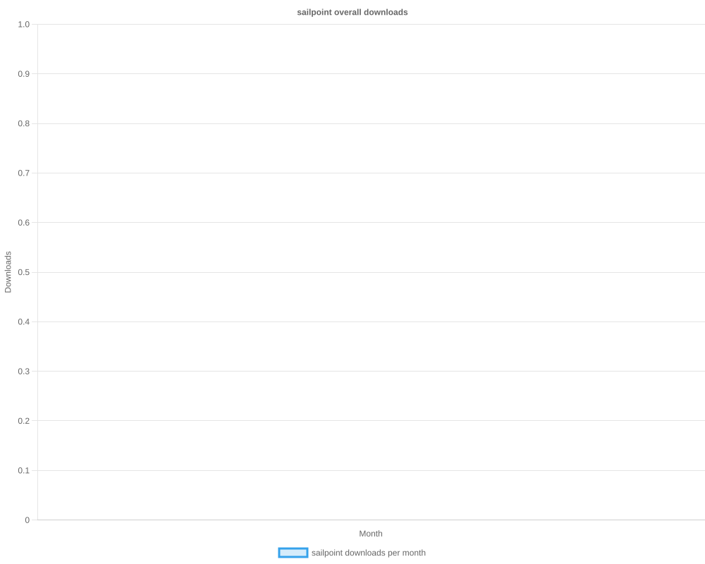
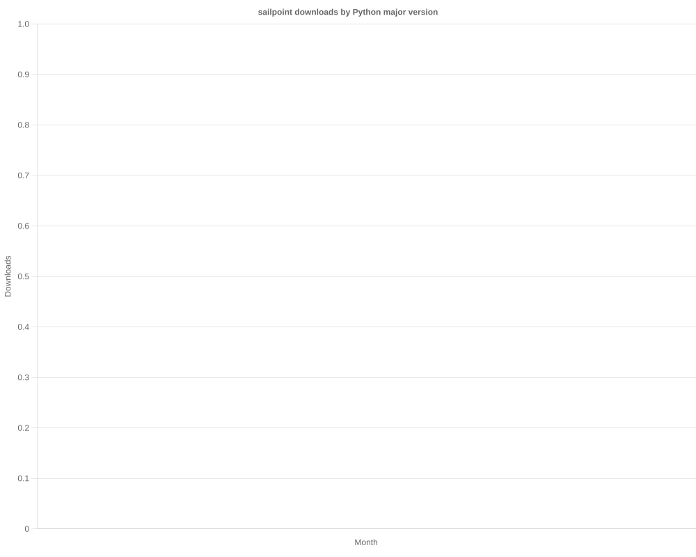

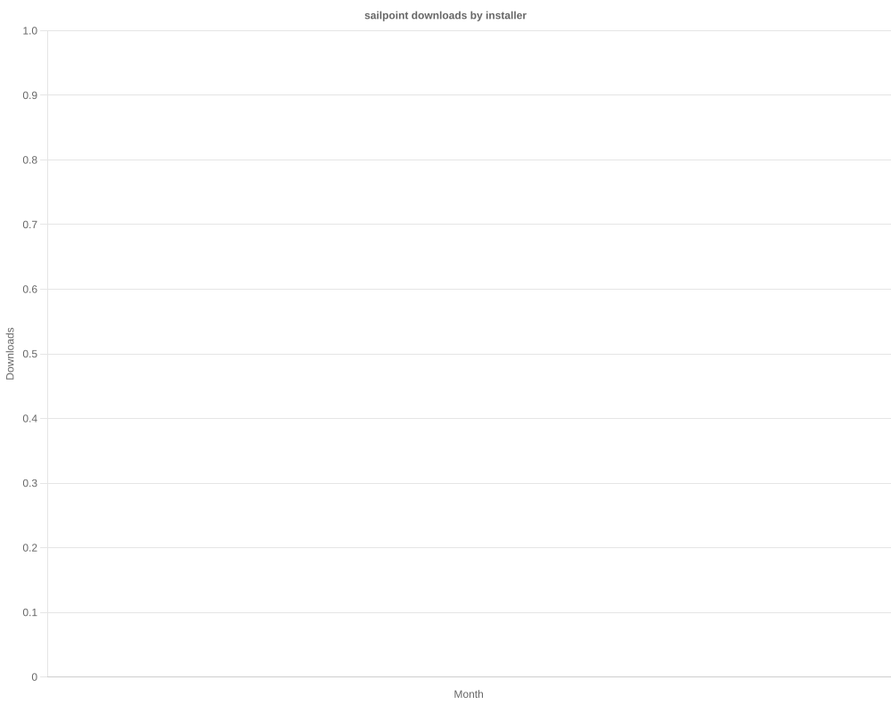

### PowerShell: 

| Module | Total Downloads | Latest Version | Version Downloads | Versions | Last Updated |
| --- | --- | --- | --- | --- | --- |
| PSSailPoint | 29,259 | 2.1.11 | 20 | 75 | 8/9/2026 |
| PSSailpoint.V3 | 18,291 | 1.7.22 | 810 | 39 | 8/9/2026 |
| PSSailpoint.Beta | 18,715 | 1.7.22 | 847 | 39 | 8/9/2026 |
| PSSailpoint.V2024 | 18,190 | 1.7.22 | 793 | 38 | 8/9/2026 |
| PSSailpoint.V2025 | 7,345 | 1.7.22 | 739 | 27 | 8/9/2026 |
| **Total** | **91,800** | | | **218** | |

#### PowerShell Module Details:

**PSSailPoint**:
- Total Downloads: 29,259
- Latest Version: 2.1.11
- Latest Version Downloads: 20
- Version Count: 75
- Last Updated: 8/9/2026
- Package Size: 11224 KB

**PSSailpoint.V3**:
- Total Downloads: 18,291
- Latest Version: 1.7.22
- Latest Version Downloads: 810
- Version Count: 39
- Last Updated: 8/9/2026
- Package Size: 1016 KB

**PSSailpoint.Beta**:
- Total Downloads: 18,715
- Latest Version: 1.7.22
- Latest Version Downloads: 847
- Version Count: 39
- Last Updated: 8/9/2026
- Package Size: 1542 KB

**PSSailpoint.V2024**:
- Total Downloads: 18,190
- Latest Version: 1.7.22
- Latest Version Downloads: 793
- Version Count: 38
- Last Updated: 8/9/2026
- Package Size: 1903 KB

**PSSailpoint.V2025**:
- Total Downloads: 7,345
- Latest Version: 1.7.22
- Latest Version Downloads: 739
- Version Count: 27
- Last Updated: 8/9/2026
- Package Size: 2170 KB

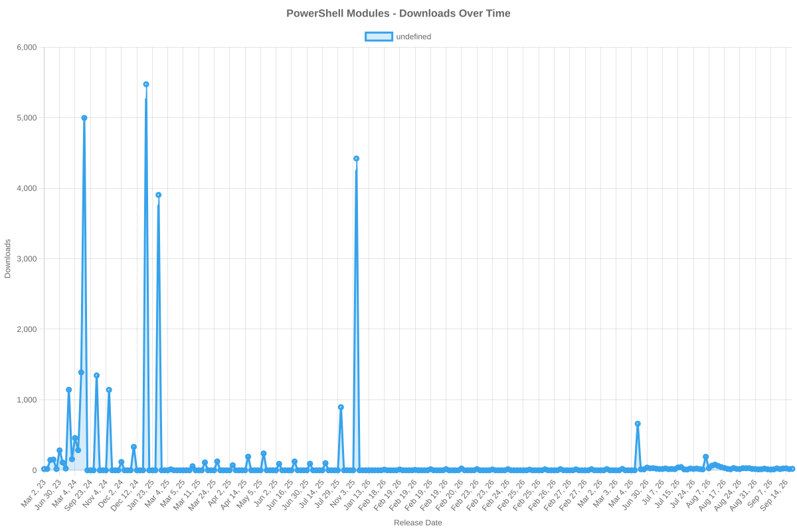
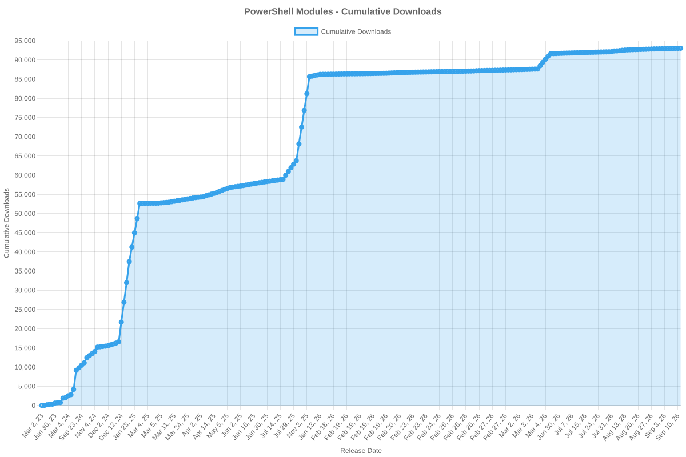

<!-- METRICS_END -->
