# SailPoint SDK Usage Statistics

<!-- METRICS_START -->
# Usage Statistics
    
Last updated: 9/28/2026, 12:06:06 AM

Below are stats from artifacts tracked across NPM, GitHub, PyPI and PowerShell.
    
### NPM (JavaScript/TypeScript): 

| Package | Downloads | Monthly Downloads | Weekly Downloads | Daily Downloads |
| --- | --- | --- | --- | --- |
| sailpoint-api-client | 229,475 | 61,605 | 5,065 | 429 |
| **Total** | **229,475** | **61,605** | **5,065** | **429** | | | | |

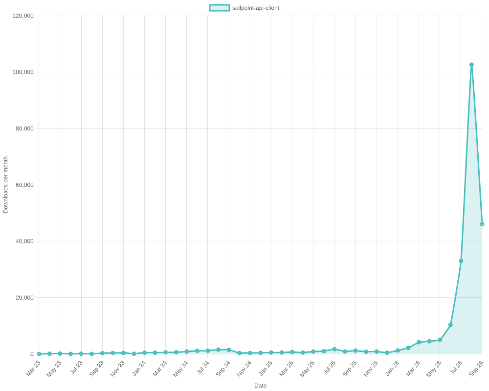
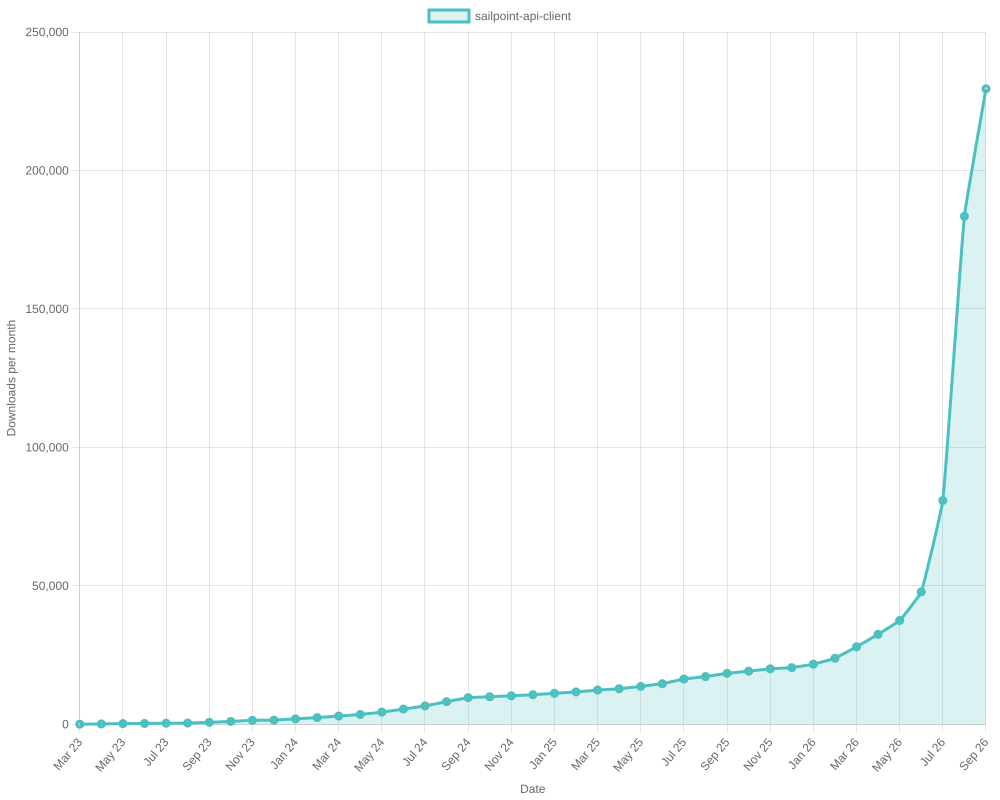

### GitHub: 

| Repository | Stars | Forks | Watchers | Open Issues | Closed Issues | Total Issues | Release Downloads | Releases | Latest Release | Language |
| --- | --- | --- | --- | --- | --- | --- | --- | --- | --- | --- |
| sailpoint-oss/sailpoint-cli | 48 | 34 | 8 | 11 | 36 | 47 | 19,634 | 37 | 2.5.0 | Go |
| sailpoint-oss/api-specs | 18 | 24 | 4 | 19 | 13 | 32 | 0 | 0 | N/A | JavaScript |
| **Total** | **66** | **58** | **12** | **30** | **49** | **79** | **19,634** | **37** | | |

#### Repository Details:

**sailpoint-oss/sailpoint-cli**:
- Last Activity: 2 days ago
- Repository Age: 1,529 days
- Release Count: 37
- Total Release Downloads: 19,634
- Latest Release: 2.5.0
- Latest Release Downloads: 671
- Views: 675
- Unique Visitors: 279
- Clones: 514
- Top Assets (by downloads):
  - sail_windows_amd64_msi: 4,811
  - sail_linux_amd64_deb: 2,999
  - sail_macos_arm64_tar.gz: 2,569
  - sail_windows_386_zip: 2,297
  - sail_windows_amd64_zip: 2,126
- OS Breakdown:
  - windows: 10,190
  - linux: 5,738
  - macos: 3,327
- Arch Breakdown:
  - amd64: 11,202
  - arm64: 4,009
  - 386: 2,880
  - armv6: 428
  - i386: 56
- Format Breakdown:
  - zip: 5,379
  - msi: 4,811
  - tar.gz: 4,502
  - deb: 3,629
  - rpm: 934

**sailpoint-oss/api-specs**:
- Last Activity: 0 days ago
- Repository Age: 1,487 days
- Release Count: 0
- Total Release Downloads: 0
- Latest Release: N/A
- Latest Release Downloads: 0
- Views: 367
- Unique Visitors: 79
- Clones: 522

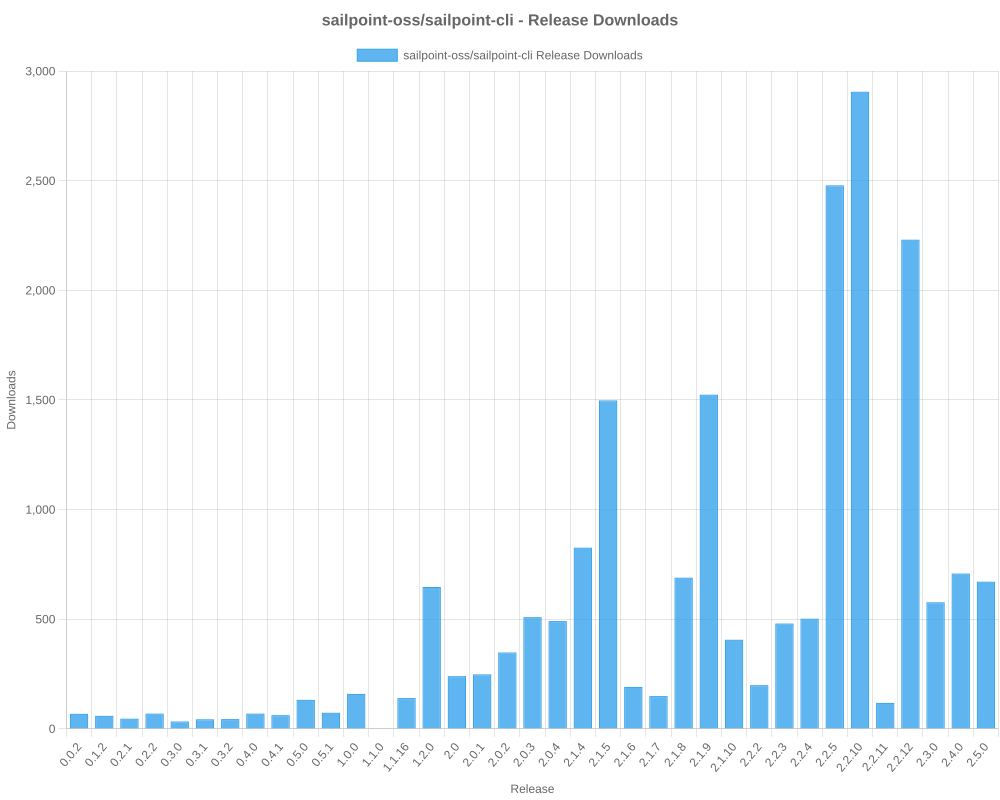
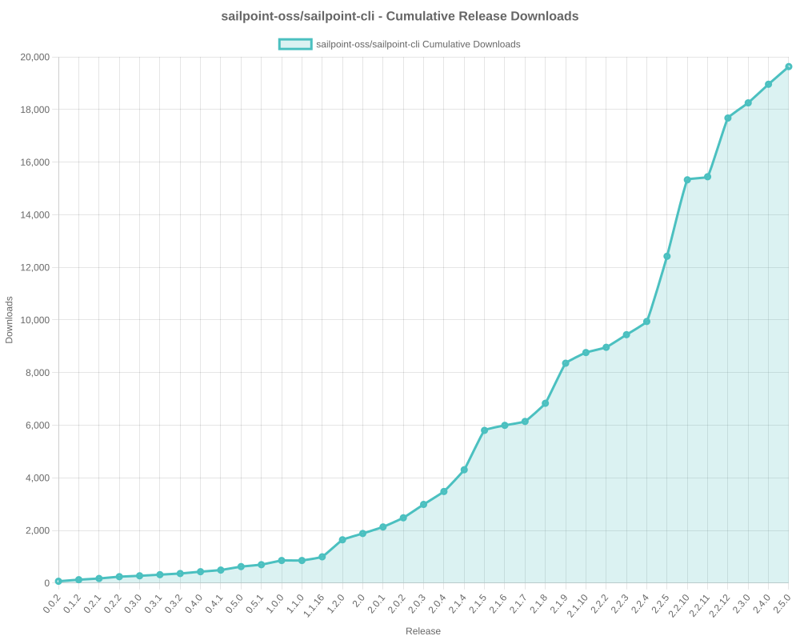
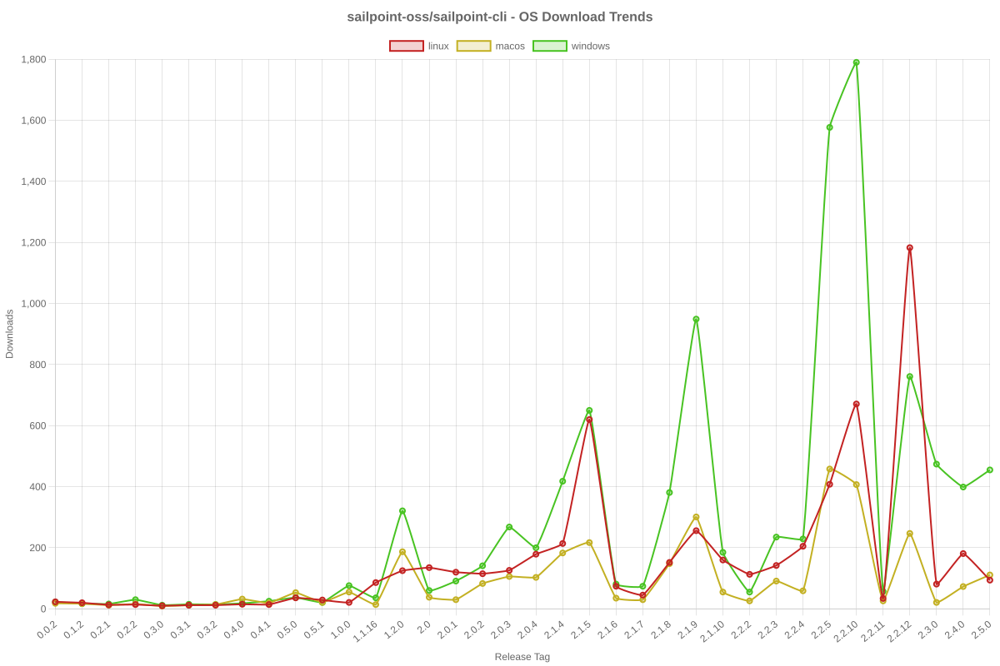
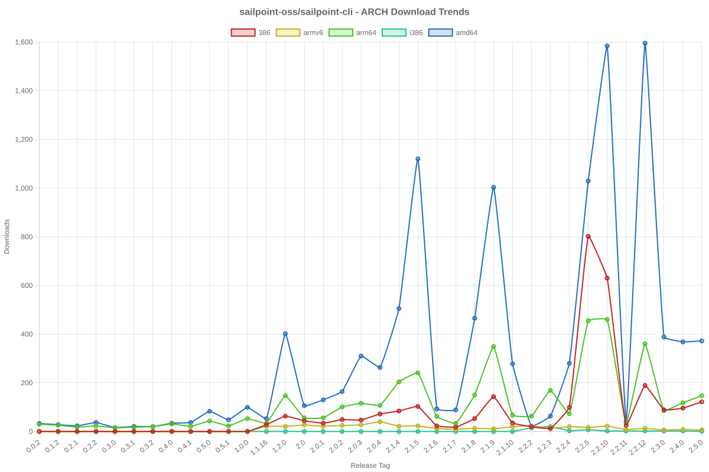
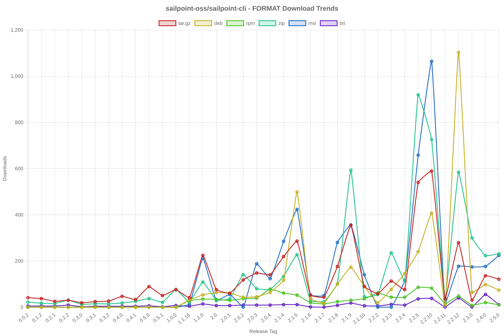

### PyPI (Python): 

| Package | Total Downloads | Monthly Downloads | Weekly Downloads | Daily Downloads | Version |
| --- | --- | --- | --- | --- | --- |
| sailpoint | 0 | 0 | 0 | 0 | N/A |
| **Total** | **0** | **0** | **0** | **0** | | |

#### Package Details:

**sailpoint**:
- Version: N/A
- Releases: 0

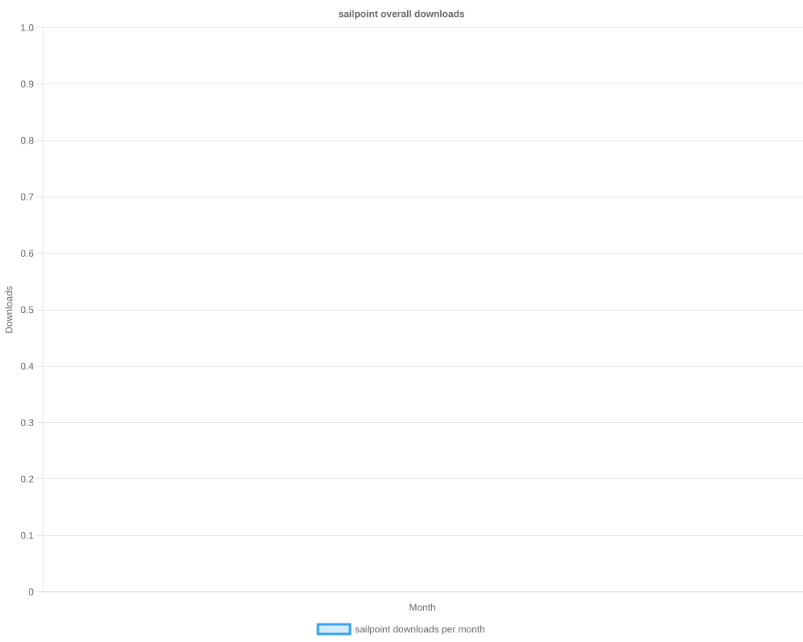
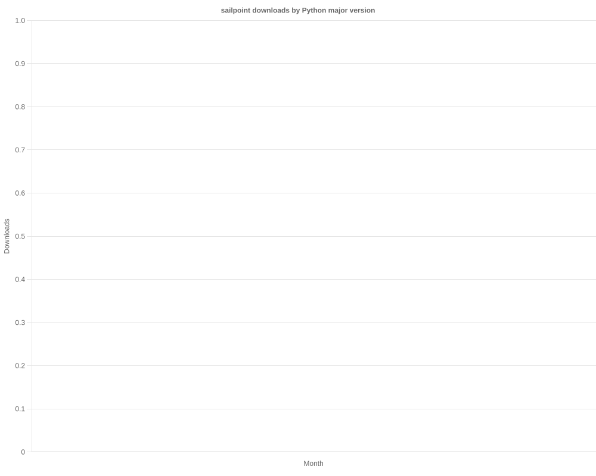

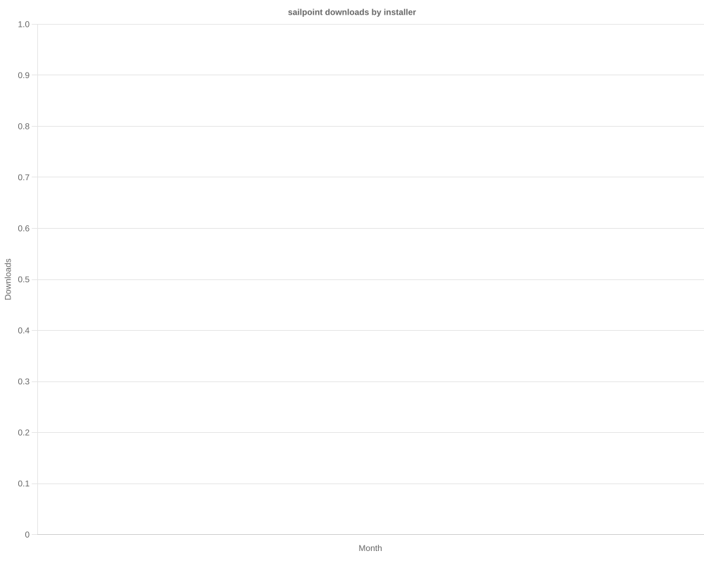

### PowerShell: 

| Module | Total Downloads | Latest Version | Version Downloads | Versions | Last Updated |
| --- | --- | --- | --- | --- | --- |
| PSSailPoint | 30,564 | N/A | 0 | 100 | 9/25/2026 |
| PSSailpoint.V3 | 18,396 | 1.7.22 | 866 | 39 | 9/26/2026 |
| PSSailpoint.Beta | 18,818 | 1.7.22 | 903 | 39 | 9/26/2026 |
| PSSailpoint.V2024 | 18,295 | 1.7.22 | 848 | 38 | 9/26/2026 |
| PSSailpoint.V2025 | 7,427 | 1.7.22 | 792 | 27 | 9/26/2026 |
| **Total** | **93,500** | | | **243** | |

#### PowerShell Module Details:

**PSSailPoint**:
- Total Downloads: 30,564
- Latest Version: N/A
- Latest Version Downloads: 0
- Version Count: 100
- Last Updated: 9/25/2026
- Package Size: 11792 KB

**PSSailpoint.V3**:
- Total Downloads: 18,396
- Latest Version: 1.7.22
- Latest Version Downloads: 866
- Version Count: 39
- Last Updated: 9/26/2026
- Package Size: 1016 KB

**PSSailpoint.Beta**:
- Total Downloads: 18,818
- Latest Version: 1.7.22
- Latest Version Downloads: 903
- Version Count: 39
- Last Updated: 9/26/2026
- Package Size: 1542 KB

**PSSailpoint.V2024**:
- Total Downloads: 18,295
- Latest Version: 1.7.22
- Latest Version Downloads: 848
- Version Count: 38
- Last Updated: 9/26/2026
- Package Size: 1903 KB

**PSSailpoint.V2025**:
- Total Downloads: 7,427
- Latest Version: 1.7.22
- Latest Version Downloads: 792
- Version Count: 27
- Last Updated: 9/26/2026
- Package Size: 2170 KB

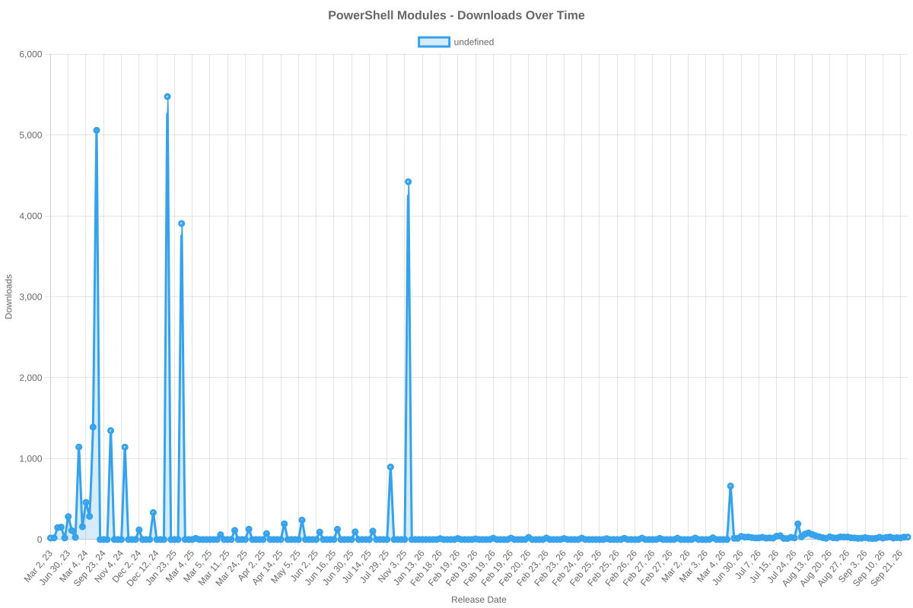
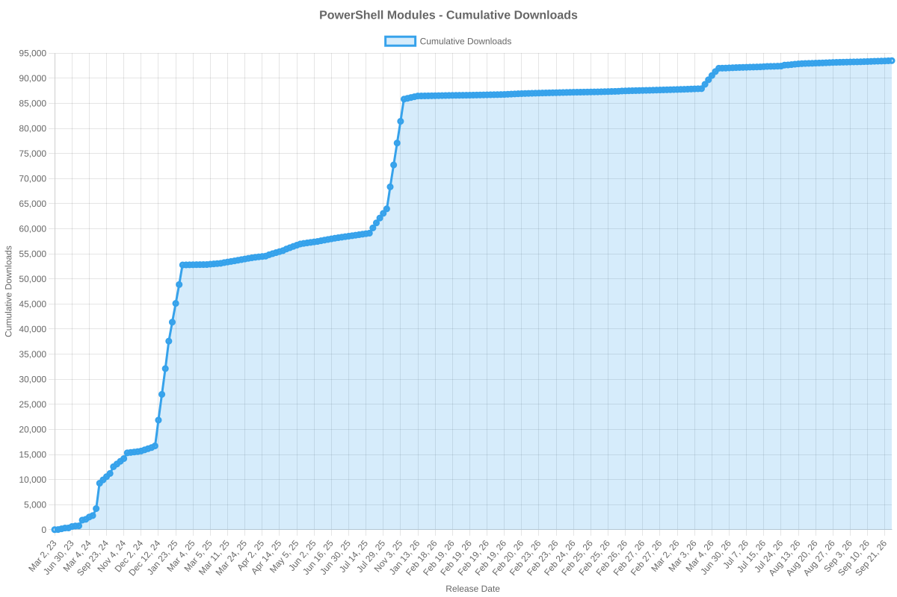

<!-- METRICS_END -->
