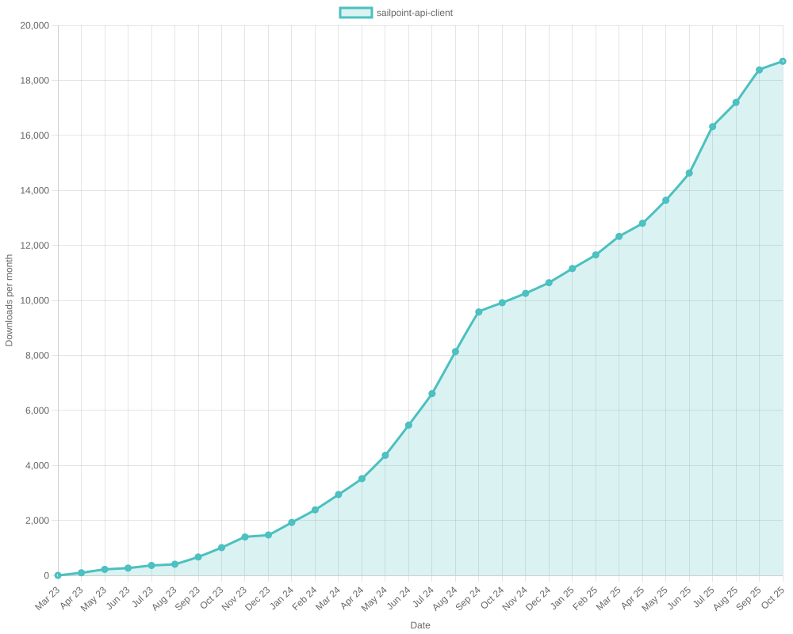

# SailPoint SDK Usage Statistics

<!-- METRICS_START -->
# Usage Statistics
    
Last updated: 11/24/2025, 12:04:59 AM

Below are stats from artifacts tracked across NPM, GitHub, PyPI and PowerShell.
    
### NPM (JavaScript/TypeScript): 

| Package | Downloads | Monthly Downloads | Weekly Downloads | Daily Downloads |
| --- | --- | --- | --- | --- |
| sailpoint-api-client | 19,899 | 908 | 162 | 6 |
| **Total** | **19,899** | **908** | **162** | **6** | | | | |

### GitHub: 

| Repository | Stars | Forks | Watchers | Open Issues | Closed Issues | Total Issues | Release Downloads | Releases | Latest Release | Language |
| --- | --- | --- | --- | --- | --- | --- | --- | --- | --- | --- |
| sailpoint-oss/sailpoint-cli | 36 | 27 | 8 | 8 | 35 | 43 | 11,409 | 31 | 2.2.5 | Go |
| sailpoint-oss/api-specs | 15 | 21 | 5 | 16 | 13 | 29 | 0 | 0 | N/A | JavaScript |
| **Total** | **51** | **48** | **13** | **24** | **48** | **72** | **11,409** | **31** | | |

#### Repository Details:

**sailpoint-oss/sailpoint-cli**:
- Last Activity: 3 days ago
- Repository Age: 1,221 days
- Release Count: 31
- Total Release Downloads: 11,409
- Latest Release: 2.2.5
- Latest Release Downloads: 1,934
- Views: 378
- Unique Visitors: 168
- Clones: 46
- Top Assets (by downloads):
  - sail_windows_amd64_msi: 2,767
  - sail_macos_arm64_tar.gz: 1,664
  - sail_windows_amd64_zip: 1,279
  - sail_windows_386_zip: 1,102
  - sail_linux_amd64_deb: 1,075
- OS Breakdown:
  - windows: 5,842
  - linux: 2,996
  - macos: 2,358
- Arch Breakdown:
  - amd64: 6,254
  - arm64: 2,683
  - 386: 1,535
  - armv6: 338
  - i386: 45
- Format Breakdown:
  - tar.gz: 3,157
  - zip: 3,075
  - msi: 2,767
  - deb: 1,566
  - rpm: 631

**sailpoint-oss/api-specs**:
- Last Activity: 0 days ago
- Repository Age: 1,179 days
- Release Count: 0
- Total Release Downloads: 0
- Latest Release: N/A
- Latest Release Downloads: 0
- Views: 149
- Unique Visitors: 52
- Clones: 317

### PyPI (Python): 

| Package | Total Downloads | Monthly Downloads | Weekly Downloads | Daily Downloads | Version |
| --- | --- | --- | --- | --- | --- |
| sailpoint | 0 | 0 | 0 | 0 | N/A |
| **Total** | **0** | **0** | **0** | **0** | | |

#### Package Details:

**sailpoint**:
- Version: N/A
- Releases: 0

### PowerShell: 

| Module | Total Downloads | Latest Version | Version Downloads | Versions | Last Updated |
| --- | --- | --- | --- | --- | --- |
| PSSailPoint | 21,813 | 1.6.7 | 142 | 33 | 11/23/2025 |
| PSSailpoint.V3 | 12,779 | 1.6.7 | 157 | 20 | 11/23/2025 |
| PSSailpoint.Beta | 13,173 | 1.6.7 | 168 | 20 | 11/23/2025 |
| PSSailpoint.V2024 | 12,756 | 1.6.7 | 157 | 20 | 11/23/2025 |
| PSSailpoint.V2025 | 2,000 | 1.6.7 | 152 | 9 | 11/23/2025 |
| **Total** | **62,521** | | | **102** | |

#### PowerShell Module Details:

**PSSailPoint**:
- Total Downloads: 21,813
- Latest Version: 1.6.7
- Latest Version Downloads: 142
- Version Count: 33
- Last Updated: 11/23/2025
- Package Size: 13766 KB

**PSSailpoint.V3**:
- Total Downloads: 12,779
- Latest Version: 1.6.7
- Latest Version Downloads: 157
- Version Count: 20
- Last Updated: 11/23/2025
- Package Size: 1009 KB

**PSSailpoint.Beta**:
- Total Downloads: 13,173
- Latest Version: 1.6.7
- Latest Version Downloads: 168
- Version Count: 20
- Last Updated: 11/23/2025
- Package Size: 1508 KB

**PSSailpoint.V2024**:
- Total Downloads: 12,756
- Latest Version: 1.6.7
- Latest Version Downloads: 157
- Version Count: 20
- Last Updated: 11/23/2025
- Package Size: 1891 KB

**PSSailpoint.V2025**:
- Total Downloads: 2,000
- Latest Version: 1.6.7
- Latest Version Downloads: 152
- Version Count: 9
- Last Updated: 11/23/2025
- Package Size: 2012 KB

<!-- METRICS_END -->
