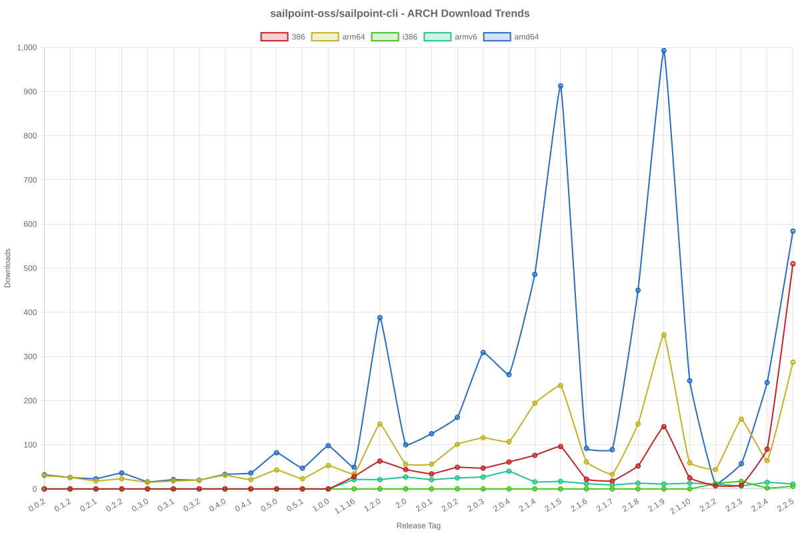

# SailPoint SDK Usage Statistics

<!-- METRICS_START -->
# Usage Statistics
    
Last updated: 9/29/2025, 12:06:43 AM

Below are stats from artifacts tracked across NPM, GitHub, PyPI and PowerShell.
    
### NPM (JavaScript/TypeScript): 

| Package | Downloads | Monthly Downloads | Weekly Downloads | Daily Downloads |
| --- | --- | --- | --- | --- |
| sailpoint-api-client | 18,254 | 1,085 | 149 | 26 |
| **Total** | **18,254** | **1,085** | **149** | **26** | | | | |

### GitHub: 

| Repository | Stars | Forks | Watchers | Open Issues | Closed Issues | Total Issues | Release Downloads | Releases | Latest Release | Language |
| --- | --- | --- | --- | --- | --- | --- | --- | --- | --- | --- |
| sailpoint-oss/sailpoint-cli | 37 | 25 | 9 | 6 | 35 | 41 | 10,632 | 31 | 2.2.5 | Go |
| sailpoint-oss/api-specs | 14 | 21 | 7 | 16 | 12 | 28 | 2,080 | 62 | v2025.09.28-0237 | JavaScript |
| **Total** | **51** | **46** | **16** | **22** | **47** | **69** | **12,712** | **93** | | |

#### Repository Details:

**sailpoint-oss/sailpoint-cli**:
- Last Activity: 16 days ago
- Repository Age: 1,165 days
- Release Count: 31
- Total Release Downloads: 10,632
- Latest Release: 2.2.5
- Latest Release Downloads: 1,326
- Views: 452
- Unique Visitors: 186
- Clones: 93
- Top Assets (by downloads):
  - sail_windows_amd64_msi: 2,555
  - sail_macos_arm64_tar.gz: 1,560
  - sail_windows_amd64_zip: 1,240
  - sail_linux_amd64_deb: 1,005
  - sail_windows_386_zip: 917
- OS Breakdown:
  - windows: 5,387
  - linux: 2,809
  - macos: 2,234
- Arch Breakdown:
  - amd64: 5,913
  - arm64: 2,537
  - 386: 1,319
  - armv6: 316
  - i386: 37
- Format Breakdown:
  - tar.gz: 2,994
  - zip: 2,832
  - msi: 2,555
  - deb: 1,464
  - rpm: 585

**sailpoint-oss/api-specs**:
- Last Activity: 0 days ago
- Repository Age: 1,123 days
- Release Count: 62
- Total Release Downloads: 2,080
- Latest Release: v2025.09.28-0237
- Latest Release Downloads: 25
- Views: 221
- Unique Visitors: 38
- Clones: 431
- Top Assets (by downloads):
  - deref.sailpoint: 2,080
- Format Breakdown:
  - yaml: 1,345
  - json: 735

### PyPI (Python): 

| Package | Total Downloads | Monthly Downloads | Weekly Downloads | Daily Downloads | Version |
| --- | --- | --- | --- | --- | --- |
| sailpoint | 14,468 | 4,176 | 0 | 0 | 1.3.8 |
| **Total** | **14,468** | **4,176** | **0** | **0** | | |

#### Package Details:

**sailpoint**:
- Version: 1.3.8
- Released: 2025-07-29
- Popular system: Linux
- Popular installer: pip
- Releases: 29
- OS Usage Breakdown 
  - other: 1030
  - Darwin: 79
  - Windows: 57
  - Linux: 6493
- Python Version Breakdown 
  - python2: 1
  - python3: 6594

### PowerShell: 

| Module | Total Downloads | Latest Version | Version Downloads | Versions | Last Updated |
| --- | --- | --- | --- | --- | --- |
| PSSailPoint | 21,023 | 1.6.6 | 494 | 32 | 9/28/2025 |
| PSSailpoint.V3 | 12,159 | 1.6.6 | 531 | 19 | 9/28/2025 |
| PSSailpoint.Beta | 12,513 | 1.6.6 | 556 | 19 | 9/28/2025 |
| PSSailpoint.V2024 | 12,143 | 1.6.6 | 515 | 19 | 9/28/2025 |
| PSSailpoint.V2025 | 1,411 | 1.6.6 | 495 | 8 | 9/28/2025 |
| **Total** | **59,249** | | | **97** | |

#### PowerShell Module Details:

**PSSailPoint**:
- Total Downloads: 21,023
- Latest Version: 1.6.6
- Latest Version Downloads: 494
- Version Count: 32
- Last Updated: 9/28/2025
- Package Size: 13618 KB

**PSSailpoint.V3**:
- Total Downloads: 12,159
- Latest Version: 1.6.6
- Latest Version Downloads: 531
- Version Count: 19
- Last Updated: 9/28/2025
- Package Size: 1023 KB

**PSSailpoint.Beta**:
- Total Downloads: 12,513
- Latest Version: 1.6.6
- Latest Version Downloads: 556
- Version Count: 19
- Last Updated: 9/28/2025
- Package Size: 1526 KB

**PSSailpoint.V2024**:
- Total Downloads: 12,143
- Latest Version: 1.6.6
- Latest Version Downloads: 515
- Version Count: 19
- Last Updated: 9/28/2025
- Package Size: 1881 KB

**PSSailpoint.V2025**:
- Total Downloads: 1,411
- Latest Version: 1.6.6
- Latest Version Downloads: 495
- Version Count: 8
- Last Updated: 9/28/2025
- Package Size: 1923 KB

<!-- METRICS_END -->
