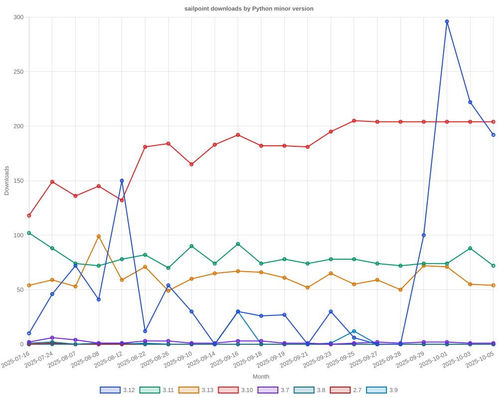

# SailPoint SDK Usage Statistics

<!-- METRICS_START -->
# Usage Statistics
    
Last updated: 10/20/2025, 12:06:59 AM

Below are stats from artifacts tracked across NPM, GitHub, PyPI and PowerShell.
    
### NPM (JavaScript/TypeScript): 

| Package | Downloads | Monthly Downloads | Weekly Downloads | Daily Downloads |
| --- | --- | --- | --- | --- |
| sailpoint-api-client | 18,921 | 866 | 242 | 53 |
| **Total** | **18,921** | **866** | **242** | **53** | | | | |

### GitHub: 

| Repository | Stars | Forks | Watchers | Open Issues | Closed Issues | Total Issues | Release Downloads | Releases | Latest Release | Language |
| --- | --- | --- | --- | --- | --- | --- | --- | --- | --- | --- |
| sailpoint-oss/sailpoint-cli | 37 | 26 | 8 | 8 | 35 | 43 | 10,945 | 31 | 2.2.5 | Go |
| sailpoint-oss/api-specs | 14 | 21 | 6 | 17 | 12 | 29 | 0 | 0 | N/A | JavaScript |
| **Total** | **51** | **47** | **14** | **25** | **47** | **72** | **10,945** | **31** | | |

#### Repository Details:

**sailpoint-oss/sailpoint-cli**:
- Last Activity: 37 days ago
- Repository Age: 1,186 days
- Release Count: 31
- Total Release Downloads: 10,945
- Latest Release: 2.2.5
- Latest Release Downloads: 1,579
- Views: 491
- Unique Visitors: 172
- Clones: 53
- Top Assets (by downloads):
  - sail_windows_amd64_msi: 2,645
  - sail_macos_arm64_tar.gz: 1,611
  - sail_windows_amd64_zip: 1,255
  - sail_linux_amd64_deb: 1,053
  - sail_windows_386_zip: 985
- OS Breakdown:
  - windows: 5,565
  - linux: 2,884
  - macos: 2,290
- Arch Breakdown:
  - amd64: 6,072
  - arm64: 2,596
  - 386: 1,395
  - armv6: 318
  - i386: 38
- Format Breakdown:
  - tar.gz: 3,059
  - zip: 2,920
  - msi: 2,645
  - deb: 1,516
  - rpm: 599

**sailpoint-oss/api-specs**:
- Last Activity: 0 days ago
- Repository Age: 1,144 days
- Release Count: 0
- Total Release Downloads: 0
- Latest Release: N/A
- Latest Release Downloads: 0
- Views: 160
- Unique Visitors: 40
- Clones: 225

### PyPI (Python): 

| Package | Total Downloads | Monthly Downloads | Weekly Downloads | Daily Downloads | Version |
| --- | --- | --- | --- | --- | --- |
| sailpoint | 0 | 0 | 0 | 0 | N/A |
| **Total** | **0** | **0** | **0** | **0** | | |

#### Package Details:

**sailpoint**:
- Version: N/A
- Releases: 0

### PowerShell: 

| Module | Total Downloads | Latest Version | Version Downloads | Versions | Last Updated |
| --- | --- | --- | --- | --- | --- |
| PSSailPoint | 21,374 | 1.6.6 | 775 | 32 | 10/17/2025 |
| PSSailpoint.V3 | 12,490 | 1.6.6 | 860 | 19 | 10/17/2025 |
| PSSailpoint.Beta | 12,845 | 1.6.6 | 886 | 19 | 10/17/2025 |
| PSSailpoint.V2024 | 12,469 | 1.6.6 | 839 | 19 | 10/17/2025 |
| PSSailpoint.V2025 | 1,726 | 1.6.6 | 808 | 8 | 10/17/2025 |
| **Total** | **60,904** | | | **97** | |

#### PowerShell Module Details:

**PSSailPoint**:
- Total Downloads: 21,374
- Latest Version: 1.6.6
- Latest Version Downloads: 775
- Version Count: 32
- Last Updated: 10/17/2025
- Package Size: 13618 KB

**PSSailpoint.V3**:
- Total Downloads: 12,490
- Latest Version: 1.6.6
- Latest Version Downloads: 860
- Version Count: 19
- Last Updated: 10/17/2025
- Package Size: 1023 KB

**PSSailpoint.Beta**:
- Total Downloads: 12,845
- Latest Version: 1.6.6
- Latest Version Downloads: 886
- Version Count: 19
- Last Updated: 10/17/2025
- Package Size: 1526 KB

**PSSailpoint.V2024**:
- Total Downloads: 12,469
- Latest Version: 1.6.6
- Latest Version Downloads: 839
- Version Count: 19
- Last Updated: 10/17/2025
- Package Size: 1881 KB

**PSSailpoint.V2025**:
- Total Downloads: 1,726
- Latest Version: 1.6.6
- Latest Version Downloads: 808
- Version Count: 8
- Last Updated: 10/17/2025
- Package Size: 1923 KB

<!-- METRICS_END -->
