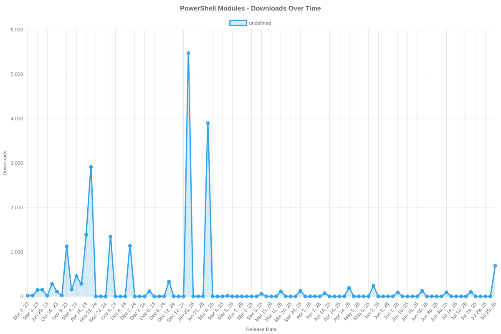

# SailPoint SDK Usage Statistics

<!-- METRICS_START -->
# Usage Statistics
    
Last updated: 12/22/2025, 12:05:08 AM

Below are stats from artifacts tracked across NPM, GitHub, PyPI and PowerShell.
    
### NPM (JavaScript/TypeScript): 

| Package | Downloads | Monthly Downloads | Weekly Downloads | Daily Downloads |
| --- | --- | --- | --- | --- |
| sailpoint-api-client | 20,386 | 533 | 111 | 4 |
| **Total** | **20,386** | **533** | **111** | **4** | | | | |

### GitHub: 

| Repository | Stars | Forks | Watchers | Open Issues | Closed Issues | Total Issues | Release Downloads | Releases | Latest Release | Language |
| --- | --- | --- | --- | --- | --- | --- | --- | --- | --- | --- |
| sailpoint-oss/sailpoint-cli | 37 | 27 | 8 | 8 | 35 | 43 | 11,772 | 31 | 2.2.5 | Go |
| sailpoint-oss/api-specs | 15 | 21 | 5 | 16 | 13 | 29 | 0 | 0 | N/A | JavaScript |
| **Total** | **52** | **48** | **13** | **24** | **48** | **72** | **11,772** | **31** | | |

#### Repository Details:

**sailpoint-oss/sailpoint-cli**:
- Last Activity: 4 days ago
- Repository Age: 1,249 days
- Release Count: 31
- Total Release Downloads: 11,772
- Latest Release: 2.2.5
- Latest Release Downloads: 2,257
- Views: 458
- Unique Visitors: 182
- Clones: 92
- Top Assets (by downloads):
  - sail_windows_amd64_msi: 2,857
  - sail_macos_arm64_tar.gz: 1,718
  - sail_windows_amd64_zip: 1,293
  - sail_windows_386_zip: 1,196
  - sail_linux_amd64_deb: 1,112
- OS Breakdown:
  - windows: 6,044
  - linux: 3,092
  - macos: 2,414
- Arch Breakdown:
  - amd64: 6,400
  - arm64: 2,753
  - 386: 1,644
  - armv6: 341
  - i386: 45
- Format Breakdown:
  - tar.gz: 3,244
  - zip: 3,187
  - msi: 2,857
  - deb: 1,614
  - rpm: 648

**sailpoint-oss/api-specs**:
- Last Activity: 0 days ago
- Repository Age: 1,207 days
- Release Count: 0
- Total Release Downloads: 0
- Latest Release: N/A
- Latest Release Downloads: 0
- Views: 156
- Unique Visitors: 50
- Clones: 172

### PyPI (Python): 

| Package | Total Downloads | Monthly Downloads | Weekly Downloads | Daily Downloads | Version |
| --- | --- | --- | --- | --- | --- |
| sailpoint | 68,647 | 17,379 | 3,477 | 0 | 1.4.0 |
| **Total** | **68,647** | **17,379** | **3,477** | **0** | | |

#### Package Details:

**sailpoint**:
- Version: 1.4.0
- Released: 2025-11-05
- Popular system: Linux
- Popular installer: pip
- Releases: 31
- OS Usage Breakdown 
  - other: 2131
  - Darwin: 134
  - Windows: 138
  - Linux: 32786
- Python Version Breakdown 
  - python3: 33001

### PowerShell: 

| Module | Total Downloads | Latest Version | Version Downloads | Versions | Last Updated |
| --- | --- | --- | --- | --- | --- |
| PSSailPoint | 23,005 | 1.6.7 | 1,218 | 33 | 12/21/2025 |
| PSSailpoint.V3 | 13,869 | 1.6.7 | 1,247 | 20 | 12/21/2025 |
| PSSailpoint.Beta | 14,267 | 1.6.7 | 1,262 | 20 | 12/21/2025 |
| PSSailpoint.V2024 | 13,849 | 1.6.7 | 1,250 | 20 | 12/21/2025 |
| PSSailpoint.V2025 | 3,079 | 1.6.7 | 1,231 | 9 | 12/21/2025 |
| **Total** | **68,069** | | | **102** | |

#### PowerShell Module Details:

**PSSailPoint**:
- Total Downloads: 23,005
- Latest Version: 1.6.7
- Latest Version Downloads: 1,218
- Version Count: 33
- Last Updated: 12/21/2025
- Package Size: 13766 KB

**PSSailpoint.V3**:
- Total Downloads: 13,869
- Latest Version: 1.6.7
- Latest Version Downloads: 1,247
- Version Count: 20
- Last Updated: 12/21/2025
- Package Size: 1009 KB

**PSSailpoint.Beta**:
- Total Downloads: 14,267
- Latest Version: 1.6.7
- Latest Version Downloads: 1,262
- Version Count: 20
- Last Updated: 12/21/2025
- Package Size: 1508 KB

**PSSailpoint.V2024**:
- Total Downloads: 13,849
- Latest Version: 1.6.7
- Latest Version Downloads: 1,250
- Version Count: 20
- Last Updated: 12/21/2025
- Package Size: 1891 KB

**PSSailpoint.V2025**:
- Total Downloads: 3,079
- Latest Version: 1.6.7
- Latest Version Downloads: 1,231
- Version Count: 9
- Last Updated: 12/21/2025
- Package Size: 2012 KB

<!-- METRICS_END -->
