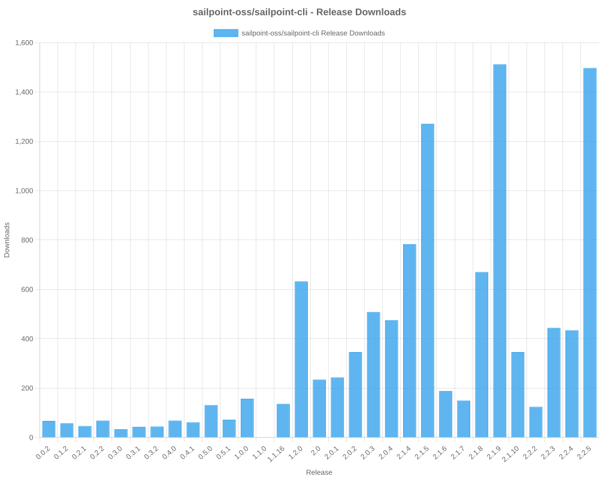

# SailPoint SDK Usage Statistics

<!-- METRICS_START -->
# Usage Statistics
    
Last updated: 1/5/2026, 12:05:11 AM

Below are stats from artifacts tracked across NPM, GitHub, PyPI and PowerShell.
    
### NPM (JavaScript/TypeScript): 

| Package | Downloads | Monthly Downloads | Weekly Downloads | Daily Downloads |
| --- | --- | --- | --- | --- |
| sailpoint-api-client | 20,456 | 311 | 35 | 3 |
| **Total** | **20,456** | **311** | **35** | **3** | | | | |

### GitHub: 

| Repository | Stars | Forks | Watchers | Open Issues | Closed Issues | Total Issues | Release Downloads | Releases | Latest Release | Language |
| --- | --- | --- | --- | --- | --- | --- | --- | --- | --- | --- |
| sailpoint-oss/sailpoint-cli | 38 | 27 | 8 | 8 | 35 | 43 | 11,851 | 31 | 2.2.5 | Go |
| sailpoint-oss/api-specs | 15 | 21 | 5 | 16 | 13 | 29 | 0 | 0 | N/A | JavaScript |
| **Total** | **53** | **48** | **13** | **24** | **48** | **72** | **11,851** | **31** | | |

#### Repository Details:

**sailpoint-oss/sailpoint-cli**:
- Last Activity: 18 days ago
- Repository Age: 1,263 days
- Release Count: 31
- Total Release Downloads: 11,851
- Latest Release: 2.2.5
- Latest Release Downloads: 2,330
- Views: 236
- Unique Visitors: 88
- Clones: 26
- Top Assets (by downloads):
  - sail_windows_amd64_msi: 2,877
  - sail_macos_arm64_tar.gz: 1,727
  - sail_windows_amd64_zip: 1,296
  - sail_windows_386_zip: 1,222
  - sail_linux_amd64_deb: 1,115
- OS Breakdown:
  - windows: 6,093
  - linux: 3,109
  - macos: 2,424
- Arch Breakdown:
  - amd64: 6,426
  - arm64: 2,762
  - 386: 1,670
  - armv6: 341
  - i386: 45
- Format Breakdown:
  - tar.gz: 3,268
  - zip: 3,216
  - msi: 2,877
  - deb: 1,617
  - rpm: 648

**sailpoint-oss/api-specs**:
- Last Activity: 0 days ago
- Repository Age: 1,221 days
- Release Count: 0
- Total Release Downloads: 0
- Latest Release: N/A
- Latest Release Downloads: 0
- Views: 63
- Unique Visitors: 24
- Clones: 168

### PyPI (Python): 

| Package | Total Downloads | Monthly Downloads | Weekly Downloads | Daily Downloads | Version |
| --- | --- | --- | --- | --- | --- |
| sailpoint | 0 | 0 | 0 | 0 | N/A |
| **Total** | **0** | **0** | **0** | **0** | | |

#### Package Details:

**sailpoint**:
- Version: N/A
- Releases: 0

### PowerShell: 

| Module | Total Downloads | Latest Version | Version Downloads | Versions | Last Updated |
| --- | --- | --- | --- | --- | --- |
| PSSailPoint | 23,750 | 1.6.7 | 1,930 | 33 | 1/4/2026 |
| PSSailpoint.V3 | 14,585 | 1.6.7 | 1,963 | 20 | 1/4/2026 |
| PSSailpoint.Beta | 14,989 | 1.6.7 | 1,984 | 20 | 1/4/2026 |
| PSSailpoint.V2024 | 14,568 | 1.6.7 | 1,969 | 20 | 1/4/2026 |
| PSSailpoint.V2025 | 3,789 | 1.6.7 | 1,941 | 9 | 1/4/2026 |
| **Total** | **71,681** | | | **102** | |

#### PowerShell Module Details:

**PSSailPoint**:
- Total Downloads: 23,750
- Latest Version: 1.6.7
- Latest Version Downloads: 1,930
- Version Count: 33
- Last Updated: 1/4/2026
- Package Size: 13766 KB

**PSSailpoint.V3**:
- Total Downloads: 14,585
- Latest Version: 1.6.7
- Latest Version Downloads: 1,963
- Version Count: 20
- Last Updated: 1/4/2026
- Package Size: 1009 KB

**PSSailpoint.Beta**:
- Total Downloads: 14,989
- Latest Version: 1.6.7
- Latest Version Downloads: 1,984
- Version Count: 20
- Last Updated: 1/4/2026
- Package Size: 1508 KB

**PSSailpoint.V2024**:
- Total Downloads: 14,568
- Latest Version: 1.6.7
- Latest Version Downloads: 1,969
- Version Count: 20
- Last Updated: 1/4/2026
- Package Size: 1891 KB

**PSSailpoint.V2025**:
- Total Downloads: 3,789
- Latest Version: 1.6.7
- Latest Version Downloads: 1,941
- Version Count: 9
- Last Updated: 1/4/2026
- Package Size: 2012 KB

<!-- METRICS_END -->
