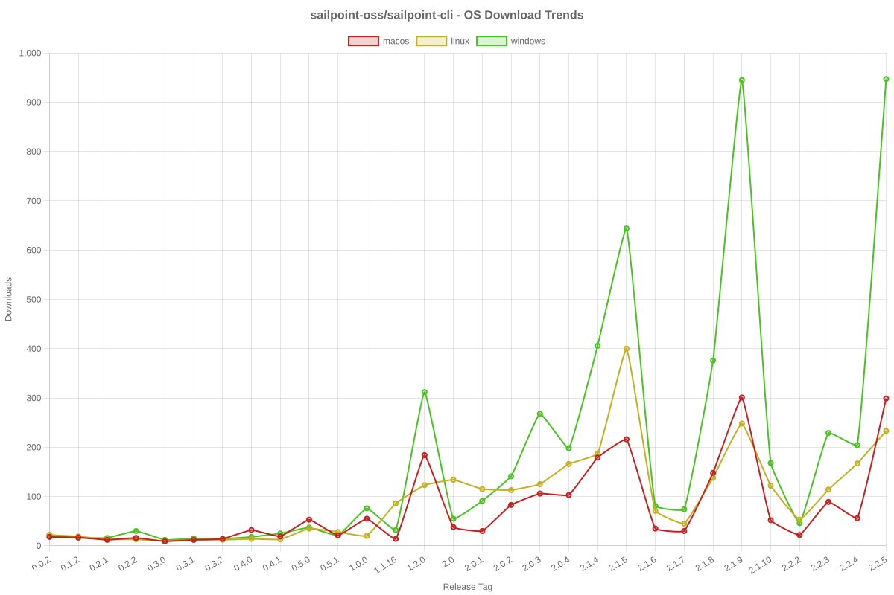
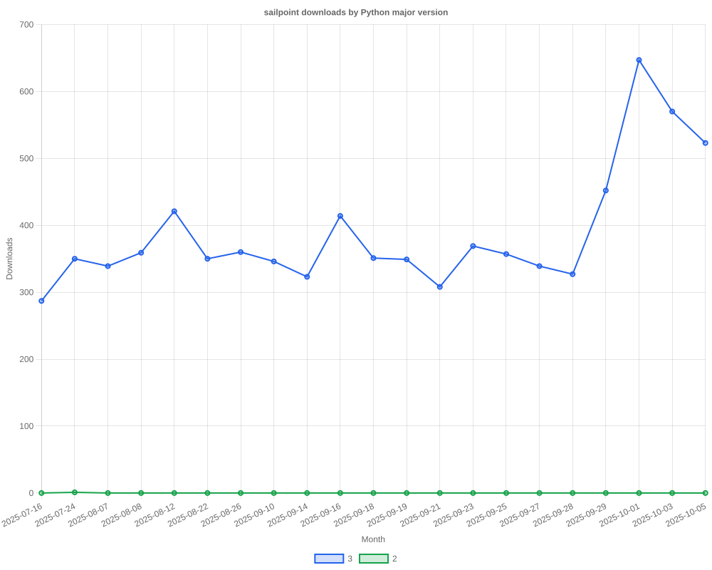

# SailPoint SDK Usage Statistics

<!-- METRICS_START -->
# Usage Statistics
    
Last updated: 11/17/2025, 12:04:36 AM

Below are stats from artifacts tracked across NPM, GitHub, PyPI and PowerShell.
    
### NPM (JavaScript/TypeScript): 

| Package | Downloads | Monthly Downloads | Weekly Downloads | Daily Downloads |
| --- | --- | --- | --- | --- |
| sailpoint-api-client | 19,737 | 870 | 139 | 5 |
| **Total** | **19,737** | **870** | **139** | **5** | | | | |

### GitHub: 

| Repository | Stars | Forks | Watchers | Open Issues | Closed Issues | Total Issues | Release Downloads | Releases | Latest Release | Language |
| --- | --- | --- | --- | --- | --- | --- | --- | --- | --- | --- |
| sailpoint-oss/sailpoint-cli | 36 | 27 | 8 | 8 | 35 | 43 | 11,340 | 31 | 2.2.5 | Go |
| sailpoint-oss/api-specs | 15 | 21 | 5 | 17 | 12 | 29 | 0 | 0 | N/A | JavaScript |
| **Total** | **51** | **48** | **13** | **25** | **47** | **72** | **11,340** | **31** | | |

#### Repository Details:

**sailpoint-oss/sailpoint-cli**:
- Last Activity: 65 days ago
- Repository Age: 1,214 days
- Release Count: 31
- Total Release Downloads: 11,340
- Latest Release: 2.2.5
- Latest Release Downloads: 1,869
- Views: 348
- Unique Visitors: 162
- Clones: 76
- Top Assets (by downloads):
  - sail_windows_amd64_msi: 2,748
  - sail_macos_arm64_tar.gz: 1,654
  - sail_windows_amd64_zip: 1,276
  - sail_windows_386_zip: 1,078
  - sail_linux_amd64_deb: 1,072
- OS Breakdown:
  - windows: 5,796
  - linux: 2,986
  - macos: 2,346
- Arch Breakdown:
  - amd64: 6,229
  - arm64: 2,672
  - 386: 1,511
  - armv6: 337
  - i386: 44
- Format Breakdown:
  - tar.gz: 3,140
  - zip: 3,048
  - msi: 2,748
  - deb: 1,561
  - rpm: 631

**sailpoint-oss/api-specs**:
- Last Activity: 0 days ago
- Repository Age: 1,172 days
- Release Count: 0
- Total Release Downloads: 0
- Latest Release: N/A
- Latest Release Downloads: 0
- Views: 240
- Unique Visitors: 56
- Clones: 393

### PyPI (Python): 

| Package | Total Downloads | Monthly Downloads | Weekly Downloads | Daily Downloads | Version |
| --- | --- | --- | --- | --- | --- |
| sailpoint | 0 | 0 | 0 | 0 | N/A |
| **Total** | **0** | **0** | **0** | **0** | | |

#### Package Details:

**sailpoint**:
- Version: N/A
- Releases: 0

### PowerShell: 

| Module | Total Downloads | Latest Version | Version Downloads | Versions | Last Updated |
| --- | --- | --- | --- | --- | --- |
| PSSailPoint | 21,700 | 1.6.7 | 85 | 33 | 11/14/2025 |
| PSSailpoint.V3 | 12,714 | 1.6.7 | 92 | 20 | 11/14/2025 |
| PSSailpoint.Beta | 13,105 | 1.6.7 | 100 | 20 | 11/14/2025 |
| PSSailpoint.V2024 | 12,692 | 1.6.7 | 93 | 20 | 11/14/2025 |
| PSSailpoint.V2025 | 1,939 | 1.6.7 | 91 | 9 | 11/14/2025 |
| **Total** | **62,150** | | | **102** | |

#### PowerShell Module Details:

**PSSailPoint**:
- Total Downloads: 21,700
- Latest Version: 1.6.7
- Latest Version Downloads: 85
- Version Count: 33
- Last Updated: 11/14/2025
- Package Size: 13766 KB

**PSSailpoint.V3**:
- Total Downloads: 12,714
- Latest Version: 1.6.7
- Latest Version Downloads: 92
- Version Count: 20
- Last Updated: 11/14/2025
- Package Size: 1009 KB

**PSSailpoint.Beta**:
- Total Downloads: 13,105
- Latest Version: 1.6.7
- Latest Version Downloads: 100
- Version Count: 20
- Last Updated: 11/14/2025
- Package Size: 1508 KB

**PSSailpoint.V2024**:
- Total Downloads: 12,692
- Latest Version: 1.6.7
- Latest Version Downloads: 93
- Version Count: 20
- Last Updated: 11/14/2025
- Package Size: 1891 KB

**PSSailpoint.V2025**:
- Total Downloads: 1,939
- Latest Version: 1.6.7
- Latest Version Downloads: 91
- Version Count: 9
- Last Updated: 11/14/2025
- Package Size: 2012 KB

<!-- METRICS_END -->
