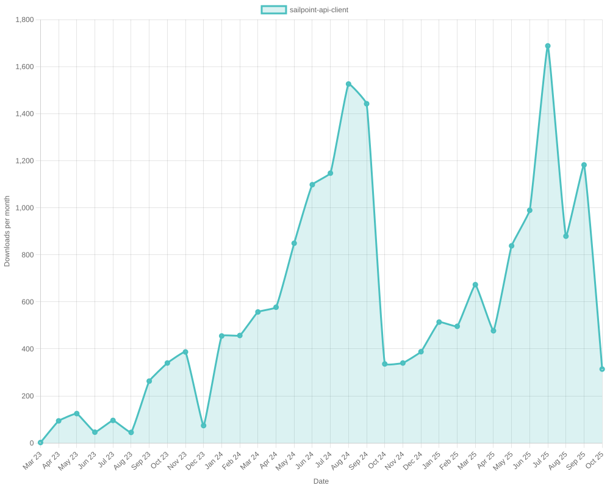
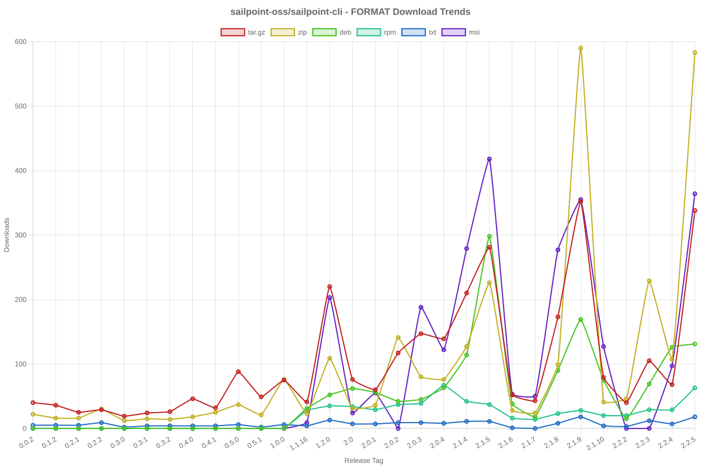

# SailPoint SDK Usage Statistics

<!-- METRICS_START -->
# Usage Statistics
    
Last updated: 1/12/2026, 12:04:49 AM

Below are stats from artifacts tracked across NPM, GitHub, PyPI and PowerShell.
    
### NPM (JavaScript/TypeScript): 

| Package | Downloads | Monthly Downloads | Weekly Downloads | Daily Downloads |
| --- | --- | --- | --- | --- |
| sailpoint-api-client | 20,518 | 278 | 62 | 5 |
| **Total** | **20,518** | **278** | **62** | **5** | | | | |

### GitHub: 

| Repository | Stars | Forks | Watchers | Open Issues | Closed Issues | Total Issues | Release Downloads | Releases | Latest Release | Language |
| --- | --- | --- | --- | --- | --- | --- | --- | --- | --- | --- |
| sailpoint-oss/sailpoint-cli | 39 | 27 | 8 | 8 | 35 | 43 | 11,937 | 32 | 2.2.10 | Go |
| sailpoint-oss/api-specs | 15 | 21 | 5 | 16 | 13 | 29 | 0 | 0 | N/A | JavaScript |
| **Total** | **54** | **48** | **13** | **24** | **48** | **72** | **11,937** | **32** | | |

#### Repository Details:

**sailpoint-oss/sailpoint-cli**:
- Last Activity: 3 days ago
- Repository Age: 1,270 days
- Release Count: 32
- Total Release Downloads: 11,937
- Latest Release: 2.2.10
- Latest Release Downloads: 31
- Views: 609
- Unique Visitors: 132
- Clones: 509
- Top Assets (by downloads):
  - sail_windows_amd64_msi: 2,897
  - sail_macos_arm64_tar.gz: 1,748
  - sail_windows_amd64_zip: 1,307
  - sail_windows_386_zip: 1,246
  - sail_linux_amd64_deb: 1,119
- OS Breakdown:
  - windows: 6,148
  - linux: 3,114
  - macos: 2,446
- Arch Breakdown:
  - amd64: 6,461
  - arm64: 2,783
  - 386: 1,695
  - armv6: 341
  - i386: 45
- Format Breakdown:
  - tar.gz: 3,290
  - zip: 3,251
  - msi: 2,897
  - deb: 1,622
  - rpm: 648

**sailpoint-oss/api-specs**:
- Last Activity: 0 days ago
- Repository Age: 1,228 days
- Release Count: 0
- Total Release Downloads: 0
- Latest Release: N/A
- Latest Release Downloads: 0
- Views: 168
- Unique Visitors: 43
- Clones: 9,825

### PyPI (Python): 

| Package | Total Downloads | Monthly Downloads | Weekly Downloads | Daily Downloads | Version |
| --- | --- | --- | --- | --- | --- |
| sailpoint | 0 | 0 | 0 | 0 | N/A |
| **Total** | **0** | **0** | **0** | **0** | | |

#### Package Details:

**sailpoint**:
- Version: N/A
- Releases: 0

### PowerShell: 

| Module | Total Downloads | Latest Version | Version Downloads | Versions | Last Updated |
| --- | --- | --- | --- | --- | --- |
| PSSailPoint | 24,173 | 1.6.7 | 2,317 | 33 | 1/11/2026 |
| PSSailpoint.V3 | 14,975 | 1.6.7 | 2,353 | 20 | 1/11/2026 |
| PSSailpoint.Beta | 15,382 | 1.6.7 | 2,377 | 20 | 1/11/2026 |
| PSSailpoint.V2024 | 14,958 | 1.6.7 | 2,359 | 20 | 1/11/2026 |
| PSSailpoint.V2025 | 4,175 | 1.6.7 | 2,327 | 9 | 1/11/2026 |
| **Total** | **73,663** | | | **102** | |

#### PowerShell Module Details:

**PSSailPoint**:
- Total Downloads: 24,173
- Latest Version: 1.6.7
- Latest Version Downloads: 2,317
- Version Count: 33
- Last Updated: 1/11/2026
- Package Size: 13766 KB

**PSSailpoint.V3**:
- Total Downloads: 14,975
- Latest Version: 1.6.7
- Latest Version Downloads: 2,353
- Version Count: 20
- Last Updated: 1/11/2026
- Package Size: 1009 KB

**PSSailpoint.Beta**:
- Total Downloads: 15,382
- Latest Version: 1.6.7
- Latest Version Downloads: 2,377
- Version Count: 20
- Last Updated: 1/11/2026
- Package Size: 1508 KB

**PSSailpoint.V2024**:
- Total Downloads: 14,958
- Latest Version: 1.6.7
- Latest Version Downloads: 2,359
- Version Count: 20
- Last Updated: 1/11/2026
- Package Size: 1891 KB

**PSSailpoint.V2025**:
- Total Downloads: 4,175
- Latest Version: 1.6.7
- Latest Version Downloads: 2,327
- Version Count: 9
- Last Updated: 1/11/2026
- Package Size: 2012 KB

<!-- METRICS_END -->
