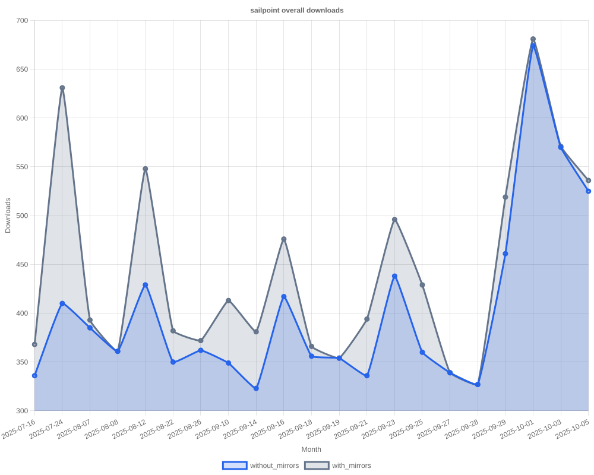

# SailPoint SDK Usage Statistics

<!-- METRICS_START -->
# Usage Statistics
    
Last updated: 2/2/2026, 12:05:54 AM

Below are stats from artifacts tracked across NPM, GitHub, PyPI and PowerShell.
    
### NPM (JavaScript/TypeScript): 

| Package | Downloads | Monthly Downloads | Weekly Downloads | Daily Downloads |
| --- | --- | --- | --- | --- |
| sailpoint-api-client | 21,669 | 1,218 | 510 | 28 |
| **Total** | **21,669** | **1,218** | **510** | **28** | | | | |

### GitHub: 

| Repository | Stars | Forks | Watchers | Open Issues | Closed Issues | Total Issues | Release Downloads | Releases | Latest Release | Language |
| --- | --- | --- | --- | --- | --- | --- | --- | --- | --- | --- |
| sailpoint-oss/sailpoint-cli | 38 | 28 | 8 | 8 | 35 | 43 | 12,293 | 32 | 2.2.10 | Go |
| sailpoint-oss/api-specs | 15 | 21 | 5 | 16 | 13 | 29 | 0 | 0 | N/A | JavaScript |
| **Total** | **53** | **49** | **13** | **24** | **48** | **72** | **12,293** | **32** | | |

#### Repository Details:

**sailpoint-oss/sailpoint-cli**:
- Last Activity: 20 days ago
- Repository Age: 1,291 days
- Release Count: 32
- Total Release Downloads: 12,293
- Latest Release: 2.2.10
- Latest Release Downloads: 345
- Views: 391
- Unique Visitors: 156
- Clones: 33
- Top Assets (by downloads):
  - sail_windows_amd64_msi: 2,997
  - sail_macos_arm64_tar.gz: 1,826
  - sail_windows_386_zip: 1,343
  - sail_windows_amd64_zip: 1,320
  - sail_linux_amd64_deb: 1,140
- OS Breakdown:
  - windows: 6,363
  - linux: 3,168
  - macos: 2,526
- Arch Breakdown:
  - amd64: 6,607
  - arm64: 2,871
  - 386: 1,801
  - armv6: 346
  - i386: 45
- Format Breakdown:
  - tar.gz: 3,373
  - zip: 3,366
  - msi: 2,997
  - deb: 1,646
  - rpm: 675

**sailpoint-oss/api-specs**:
- Last Activity: 0 days ago
- Repository Age: 1,249 days
- Release Count: 0
- Total Release Downloads: 0
- Latest Release: N/A
- Latest Release Downloads: 0
- Views: 216
- Unique Visitors: 45
- Clones: 282

### PyPI (Python): 

| Package | Total Downloads | Monthly Downloads | Weekly Downloads | Daily Downloads | Version |
| --- | --- | --- | --- | --- | --- |
| sailpoint | 0 | 0 | 0 | 0 | N/A |
| **Total** | **0** | **0** | **0** | **0** | | |

#### Package Details:

**sailpoint**:
- Version: N/A
- Releases: 0

### PowerShell: 

| Module | Total Downloads | Latest Version | Version Downloads | Versions | Last Updated |
| --- | --- | --- | --- | --- | --- |
| PSSailPoint | 25,422 | 1.6.7 | 3,494 | 33 | 2/1/2026 |
| PSSailpoint.V3 | 16,191 | 1.7.1 | 93 | 21 | 1/31/2026 |
| PSSailpoint.Beta | 16,592 | 1.7.1 | 83 | 21 | 1/31/2026 |
| PSSailpoint.V2024 | 16,168 | 1.7.1 | 88 | 21 | 1/31/2026 |
| PSSailpoint.V2025 | 5,378 | 1.7.1 | 81 | 10 | 1/30/2026 |
| **Total** | **79,751** | | | **106** | |

#### PowerShell Module Details:

**PSSailPoint**:
- Total Downloads: 25,422
- Latest Version: 1.6.7
- Latest Version Downloads: 3,494
- Version Count: 33
- Last Updated: 2/1/2026
- Package Size: 13766 KB

**PSSailpoint.V3**:
- Total Downloads: 16,191
- Latest Version: 1.7.1
- Latest Version Downloads: 93
- Version Count: 21
- Last Updated: 1/31/2026
- Package Size: 1015 KB

**PSSailpoint.Beta**:
- Total Downloads: 16,592
- Latest Version: 1.7.1
- Latest Version Downloads: 83
- Version Count: 21
- Last Updated: 1/31/2026
- Package Size: 1539 KB

**PSSailpoint.V2024**:
- Total Downloads: 16,168
- Latest Version: 1.7.1
- Latest Version Downloads: 88
- Version Count: 21
- Last Updated: 1/31/2026
- Package Size: 1900 KB

**PSSailpoint.V2025**:
- Total Downloads: 5,378
- Latest Version: 1.7.1
- Latest Version Downloads: 81
- Version Count: 10
- Last Updated: 1/30/2026
- Package Size: 2113 KB

<!-- METRICS_END -->
