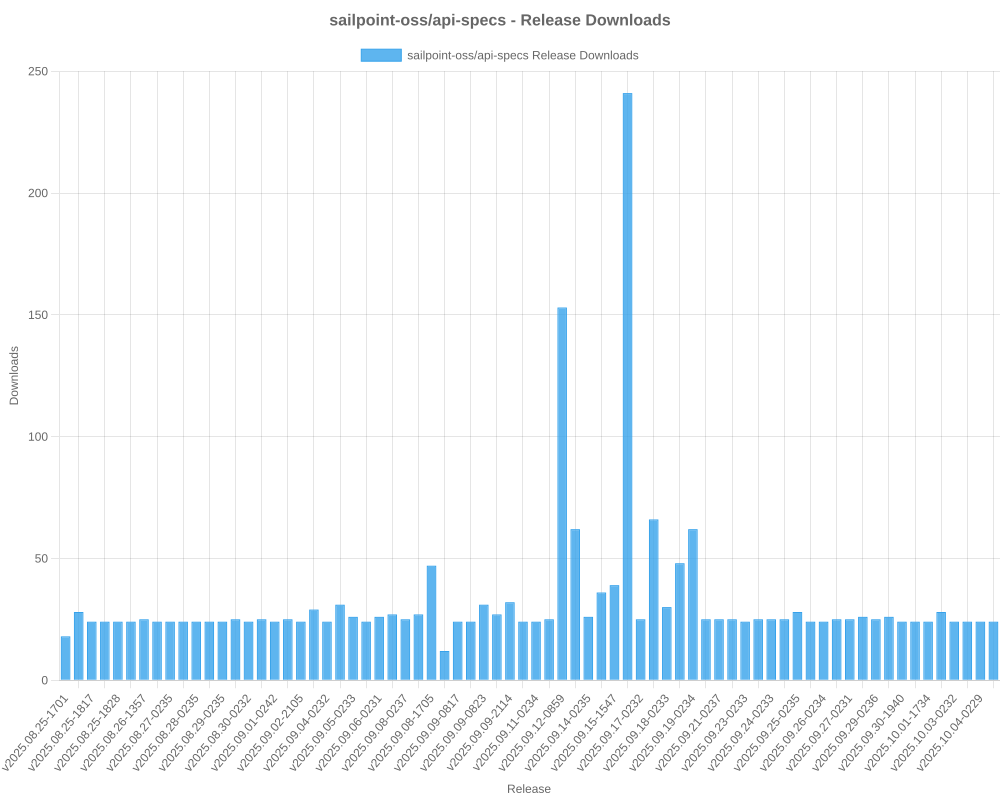

# SailPoint SDK Usage Statistics

<!-- METRICS_START -->
# Usage Statistics
    
Last updated: 10/6/2025, 12:06:00 AM

Below are stats from artifacts tracked across NPM, GitHub, PyPI and PowerShell.
    
### NPM (JavaScript/TypeScript): 

| Package | Downloads | Monthly Downloads | Weekly Downloads | Daily Downloads |
| --- | --- | --- | --- | --- |
| sailpoint-api-client | 18,571 | 1,166 | 317 | 5 |
| **Total** | **18,571** | **1,166** | **317** | **5** | | | | |

### GitHub: 

| Repository | Stars | Forks | Watchers | Open Issues | Closed Issues | Total Issues | Release Downloads | Releases | Latest Release | Language |
| --- | --- | --- | --- | --- | --- | --- | --- | --- | --- | --- |
| sailpoint-oss/sailpoint-cli | 37 | 25 | 8 | 8 | 35 | 43 | 10,743 | 31 | 2.2.5 | Go |
| sailpoint-oss/api-specs | 14 | 21 | 6 | 16 | 12 | 28 | 2,328 | 72 | v2025.10.05-0237 | JavaScript |
| **Total** | **51** | **46** | **14** | **24** | **47** | **71** | **13,071** | **103** | | |

#### Repository Details:

**sailpoint-oss/sailpoint-cli**:
- Last Activity: 23 days ago
- Repository Age: 1,172 days
- Release Count: 31
- Total Release Downloads: 10,743
- Latest Release: 2.2.5
- Latest Release Downloads: 1,411
- Views: 386
- Unique Visitors: 160
- Clones: 87
- Top Assets (by downloads):
  - sail_windows_amd64_msi: 2,582
  - sail_macos_arm64_tar.gz: 1,575
  - sail_windows_amd64_zip: 1,245
  - sail_linux_amd64_deb: 1,032
  - sail_windows_386_zip: 941
- OS Breakdown:
  - windows: 5,444
  - linux: 2,844
  - macos: 2,249
- Arch Breakdown:
  - amd64: 5,973
  - arm64: 2,553
  - 386: 1,343
  - armv6: 316
  - i386: 37
- Format Breakdown:
  - tar.gz: 3,016
  - zip: 2,862
  - msi: 2,582
  - deb: 1,491
  - rpm: 586

**sailpoint-oss/api-specs**:
- Last Activity: 0 days ago
- Repository Age: 1,130 days
- Release Count: 72
- Total Release Downloads: 2,328
- Latest Release: v2025.10.05-0237
- Latest Release Downloads: 24
- Views: 132
- Unique Visitors: 41
- Clones: 265
- Top Assets (by downloads):
  - deref.sailpoint: 2,328
- Format Breakdown:
  - yaml: 1,473
  - json: 855

### PyPI (Python): 

| Package | Total Downloads | Monthly Downloads | Weekly Downloads | Daily Downloads | Version |
| --- | --- | --- | --- | --- | --- |
| sailpoint | 14,782 | 4,312 | 0 | 0 | 1.3.8 |
| **Total** | **14,782** | **4,312** | **0** | **0** | | |

#### Package Details:

**sailpoint**:
- Version: 1.3.8
- Released: 2025-07-29
- Popular system: Linux
- Popular installer: pip
- Releases: 29
- OS Usage Breakdown 
  - other: 1161
  - Darwin: 73
  - Windows: 63
  - Linux: 6540
- Python Version Breakdown 
  - python2: 1
  - python3: 6637

### PowerShell: 

| Module | Total Downloads | Latest Version | Version Downloads | Versions | Last Updated |
| --- | --- | --- | --- | --- | --- |
| PSSailPoint | 21,109 | 1.6.6 | 560 | 32 | 10/4/2025 |
| PSSailpoint.V3 | 12,232 | 1.6.6 | 604 | 19 | 10/4/2025 |
| PSSailpoint.Beta | 12,584 | 1.6.6 | 627 | 19 | 10/4/2025 |
| PSSailpoint.V2024 | 12,214 | 1.6.6 | 586 | 19 | 10/4/2025 |
| PSSailpoint.V2025 | 1,482 | 1.6.6 | 566 | 8 | 10/4/2025 |
| **Total** | **59,621** | | | **97** | |

#### PowerShell Module Details:

**PSSailPoint**:
- Total Downloads: 21,109
- Latest Version: 1.6.6
- Latest Version Downloads: 560
- Version Count: 32
- Last Updated: 10/4/2025
- Package Size: 13618 KB

**PSSailpoint.V3**:
- Total Downloads: 12,232
- Latest Version: 1.6.6
- Latest Version Downloads: 604
- Version Count: 19
- Last Updated: 10/4/2025
- Package Size: 1023 KB

**PSSailpoint.Beta**:
- Total Downloads: 12,584
- Latest Version: 1.6.6
- Latest Version Downloads: 627
- Version Count: 19
- Last Updated: 10/4/2025
- Package Size: 1526 KB

**PSSailpoint.V2024**:
- Total Downloads: 12,214
- Latest Version: 1.6.6
- Latest Version Downloads: 586
- Version Count: 19
- Last Updated: 10/4/2025
- Package Size: 1881 KB

**PSSailpoint.V2025**:
- Total Downloads: 1,482
- Latest Version: 1.6.6
- Latest Version Downloads: 566
- Version Count: 8
- Last Updated: 10/4/2025
- Package Size: 1923 KB

<!-- METRICS_END -->
