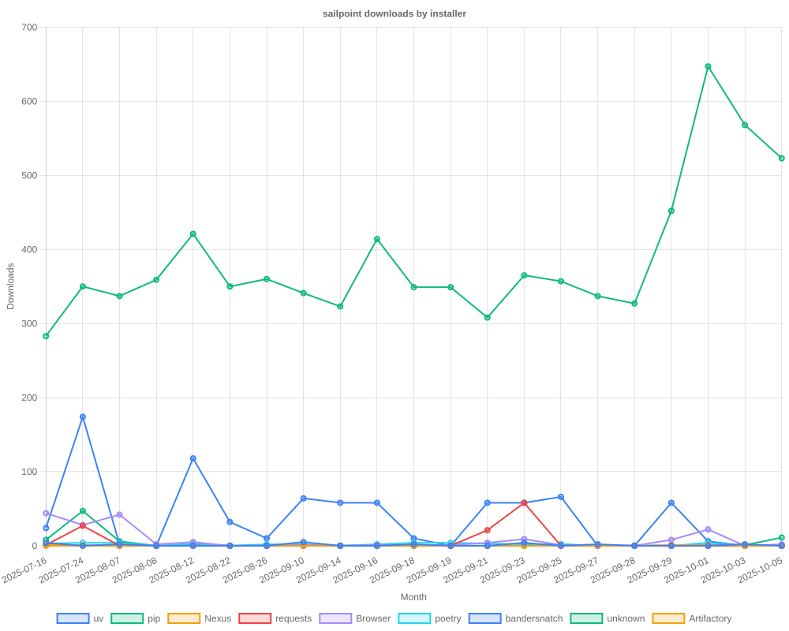

# SailPoint SDK Usage Statistics

<!-- METRICS_START -->
# Usage Statistics
    
Last updated: 12/15/2025, 12:04:45 AM

Below are stats from artifacts tracked across NPM, GitHub, PyPI and PowerShell.
    
### NPM (JavaScript/TypeScript): 

| Package | Downloads | Monthly Downloads | Weekly Downloads | Daily Downloads |
| --- | --- | --- | --- | --- |
| sailpoint-api-client | 20,275 | 558 | 116 | 2 |
| **Total** | **20,275** | **558** | **116** | **2** | | | | |

### GitHub: 

| Repository | Stars | Forks | Watchers | Open Issues | Closed Issues | Total Issues | Release Downloads | Releases | Latest Release | Language |
| --- | --- | --- | --- | --- | --- | --- | --- | --- | --- | --- |
| sailpoint-oss/sailpoint-cli | 0 | 0 | 0 | 0 | 0 | 0 | 0 | 0 | N/A | N/A |
| sailpoint-oss/api-specs | 0 | 0 | 0 | 0 | 0 | 0 | 0 | 0 | N/A | N/A |
| **Total** | **0** | **0** | **0** | **0** | **0** | **0** | **0** | **0** | | |

#### Repository Details:

**sailpoint-oss/sailpoint-cli**:
- Last Activity: 0 days ago
- Repository Age: 0 days
- Release Count: 0
- Total Release Downloads: 0
- Latest Release: N/A
- Latest Release Downloads: 0
- Views: 0
- Unique Visitors: 0
- Clones: 0

**sailpoint-oss/api-specs**:
- Last Activity: 0 days ago
- Repository Age: 0 days
- Release Count: 0
- Total Release Downloads: 0
- Latest Release: N/A
- Latest Release Downloads: 0
- Views: 0
- Unique Visitors: 0
- Clones: 0

### PyPI (Python): 

| Package | Total Downloads | Monthly Downloads | Weekly Downloads | Daily Downloads | Version |
| --- | --- | --- | --- | --- | --- |
| sailpoint | 0 | 0 | 0 | 0 | N/A |
| **Total** | **0** | **0** | **0** | **0** | | |

#### Package Details:

**sailpoint**:
- Version: N/A
- Releases: 0

### PowerShell: 

| Module | Total Downloads | Latest Version | Version Downloads | Versions | Last Updated |
| --- | --- | --- | --- | --- | --- |
| PSSailPoint | 22,599 | 1.6.7 | 838 | 33 | 12/14/2025 |
| PSSailpoint.V3 | 13,484 | 1.6.7 | 862 | 20 | 12/14/2025 |
| PSSailpoint.Beta | 13,880 | 1.6.7 | 875 | 20 | 12/14/2025 |
| PSSailpoint.V2024 | 13,458 | 1.6.7 | 859 | 20 | 12/14/2025 |
| PSSailpoint.V2025 | 2,697 | 1.6.7 | 849 | 9 | 12/14/2025 |
| **Total** | **66,118** | | | **102** | |

#### PowerShell Module Details:

**PSSailPoint**:
- Total Downloads: 22,599
- Latest Version: 1.6.7
- Latest Version Downloads: 838
- Version Count: 33
- Last Updated: 12/14/2025
- Package Size: 13766 KB

**PSSailpoint.V3**:
- Total Downloads: 13,484
- Latest Version: 1.6.7
- Latest Version Downloads: 862
- Version Count: 20
- Last Updated: 12/14/2025
- Package Size: 1009 KB

**PSSailpoint.Beta**:
- Total Downloads: 13,880
- Latest Version: 1.6.7
- Latest Version Downloads: 875
- Version Count: 20
- Last Updated: 12/14/2025
- Package Size: 1508 KB

**PSSailpoint.V2024**:
- Total Downloads: 13,458
- Latest Version: 1.6.7
- Latest Version Downloads: 859
- Version Count: 20
- Last Updated: 12/14/2025
- Package Size: 1891 KB

**PSSailpoint.V2025**:
- Total Downloads: 2,697
- Latest Version: 1.6.7
- Latest Version Downloads: 849
- Version Count: 9
- Last Updated: 12/14/2025
- Package Size: 2012 KB

<!-- METRICS_END -->
