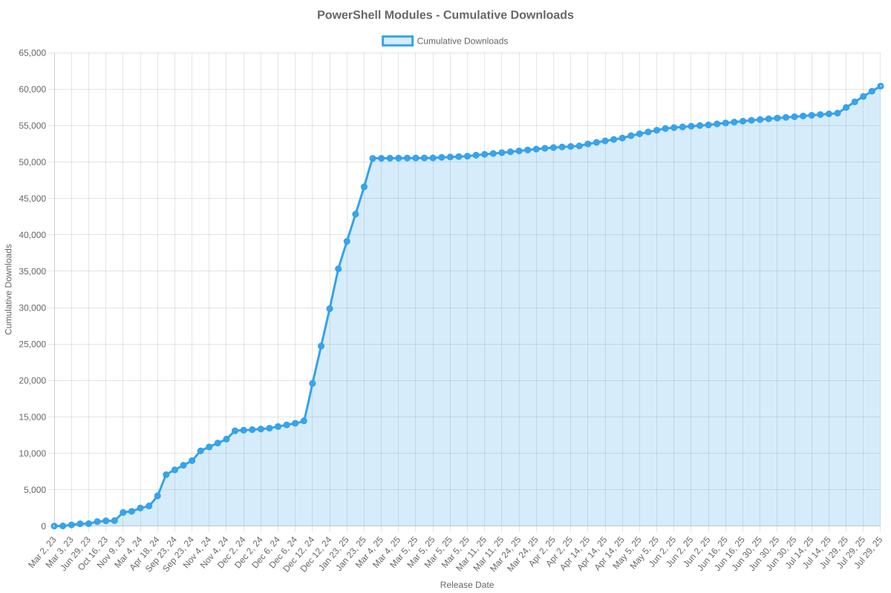

# SailPoint SDK Usage Statistics

<!-- METRICS_START -->
# Usage Statistics
    
Last updated: 10/27/2025, 12:05:07 AM

Below are stats from artifacts tracked across NPM, GitHub, PyPI and PowerShell.
    
### NPM (JavaScript/TypeScript): 

| Package | Downloads | Monthly Downloads | Weekly Downloads | Daily Downloads |
| --- | --- | --- | --- | --- |
| sailpoint-api-client | 19,017 | 800 | 96 | 2 |
| **Total** | **19,017** | **800** | **96** | **2** | | | | |

### GitHub: 

| Repository | Stars | Forks | Watchers | Open Issues | Closed Issues | Total Issues | Release Downloads | Releases | Latest Release | Language |
| --- | --- | --- | --- | --- | --- | --- | --- | --- | --- | --- |
| sailpoint-oss/sailpoint-cli | 36 | 27 | 8 | 8 | 35 | 43 | 11,027 | 31 | 2.2.5 | Go |
| sailpoint-oss/api-specs | 15 | 21 | 6 | 17 | 12 | 29 | 0 | 0 | N/A | JavaScript |
| **Total** | **51** | **48** | **14** | **25** | **47** | **72** | **11,027** | **31** | | |

#### Repository Details:

**sailpoint-oss/sailpoint-cli**:
- Last Activity: 44 days ago
- Repository Age: 1,193 days
- Release Count: 31
- Total Release Downloads: 11,027
- Latest Release: 2.2.5
- Latest Release Downloads: 1,647
- Views: 381
- Unique Visitors: 148
- Clones: 81
- Top Assets (by downloads):
  - sail_windows_amd64_msi: 2,663
  - sail_macos_arm64_tar.gz: 1,624
  - sail_windows_amd64_zip: 1,257
  - sail_linux_amd64_deb: 1,059
  - sail_windows_386_zip: 1,006
- OS Breakdown:
  - windows: 5,608
  - linux: 2,903
  - macos: 2,308
- Arch Breakdown:
  - amd64: 6,104
  - arm64: 2,613
  - 386: 1,419
  - armv6: 321
  - i386: 39
- Format Breakdown:
  - tar.gz: 3,080
  - zip: 2,945
  - msi: 2,663
  - deb: 1,525
  - rpm: 606

**sailpoint-oss/api-specs**:
- Last Activity: 0 days ago
- Repository Age: 1,151 days
- Release Count: 0
- Total Release Downloads: 0
- Latest Release: N/A
- Latest Release Downloads: 0
- Views: 197
- Unique Visitors: 47
- Clones: 368

### PyPI (Python): 

| Package | Total Downloads | Monthly Downloads | Weekly Downloads | Daily Downloads | Version |
| --- | --- | --- | --- | --- | --- |
| sailpoint | 0 | 0 | 0 | 0 | N/A |
| **Total** | **0** | **0** | **0** | **0** | | |

#### Package Details:

**sailpoint**:
- Version: N/A
- Releases: 0

### PowerShell: 

| Module | Total Downloads | Latest Version | Version Downloads | Versions | Last Updated |
| --- | --- | --- | --- | --- | --- |
| PSSailPoint | 21,442 | 1.6.6 | 812 | 32 | 10/25/2025 |
| PSSailpoint.V3 | 12,539 | 1.6.6 | 908 | 19 | 10/26/2025 |
| PSSailpoint.Beta | 12,924 | 1.6.6 | 964 | 19 | 10/25/2025 |
| PSSailpoint.V2024 | 12,516 | 1.6.6 | 885 | 19 | 10/26/2025 |
| PSSailpoint.V2025 | 1,770 | 1.6.6 | 852 | 8 | 10/25/2025 |
| **Total** | **61,191** | | | **97** | |

#### PowerShell Module Details:

**PSSailPoint**:
- Total Downloads: 21,442
- Latest Version: 1.6.6
- Latest Version Downloads: 812
- Version Count: 32
- Last Updated: 10/25/2025
- Package Size: 13618 KB

**PSSailpoint.V3**:
- Total Downloads: 12,539
- Latest Version: 1.6.6
- Latest Version Downloads: 908
- Version Count: 19
- Last Updated: 10/26/2025
- Package Size: 1023 KB

**PSSailpoint.Beta**:
- Total Downloads: 12,924
- Latest Version: 1.6.6
- Latest Version Downloads: 964
- Version Count: 19
- Last Updated: 10/25/2025
- Package Size: 1526 KB

**PSSailpoint.V2024**:
- Total Downloads: 12,516
- Latest Version: 1.6.6
- Latest Version Downloads: 885
- Version Count: 19
- Last Updated: 10/26/2025
- Package Size: 1881 KB

**PSSailpoint.V2025**:
- Total Downloads: 1,770
- Latest Version: 1.6.6
- Latest Version Downloads: 852
- Version Count: 8
- Last Updated: 10/25/2025
- Package Size: 1923 KB

<!-- METRICS_END -->
