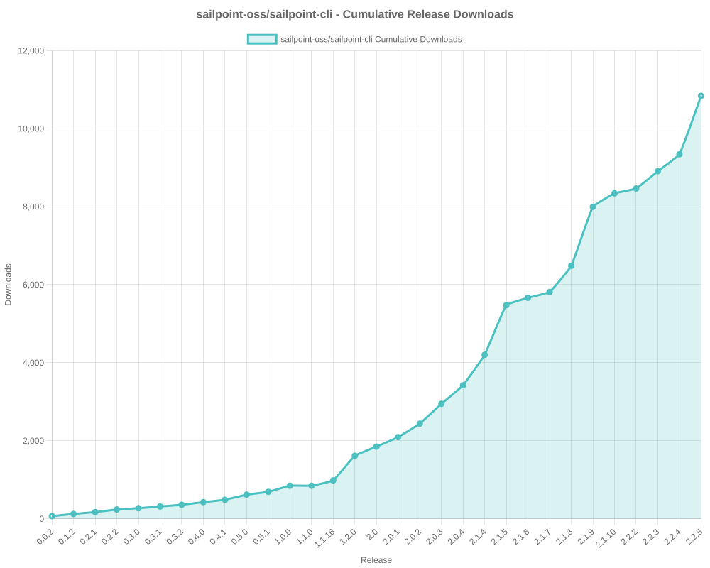

# SailPoint SDK Usage Statistics

<!-- METRICS_START -->
# Usage Statistics
    
Last updated: 10/13/2025, 12:06:23 AM

Below are stats from artifacts tracked across NPM, GitHub, PyPI and PowerShell.
    
### NPM (JavaScript/TypeScript): 

| Package | Downloads | Monthly Downloads | Weekly Downloads | Daily Downloads |
| --- | --- | --- | --- | --- |
| sailpoint-api-client | 18,694 | 853 | 123 | 16 |
| **Total** | **18,694** | **853** | **123** | **16** | | | | |

### GitHub: 

| Repository | Stars | Forks | Watchers | Open Issues | Closed Issues | Total Issues | Release Downloads | Releases | Latest Release | Language |
| --- | --- | --- | --- | --- | --- | --- | --- | --- | --- | --- |
| sailpoint-oss/sailpoint-cli | 37 | 25 | 8 | 8 | 35 | 43 | 10,839 | 31 | 2.2.5 | Go |
| sailpoint-oss/api-specs | 14 | 21 | 6 | 17 | 12 | 29 | 0 | 0 | N/A | JavaScript |
| **Total** | **51** | **46** | **14** | **25** | **47** | **72** | **10,839** | **31** | | |

#### Repository Details:

**sailpoint-oss/sailpoint-cli**:
- Last Activity: 30 days ago
- Repository Age: 1,179 days
- Release Count: 31
- Total Release Downloads: 10,839
- Latest Release: 2.2.5
- Latest Release Downloads: 1,497
- Views: 420
- Unique Visitors: 176
- Clones: 72
- Top Assets (by downloads):
  - sail_windows_amd64_msi: 2,621
  - sail_macos_arm64_tar.gz: 1,588
  - sail_windows_amd64_zip: 1,252
  - sail_linux_amd64_deb: 1,035
  - sail_windows_386_zip: 968
- OS Breakdown:
  - windows: 5,519
  - linux: 2,851
  - macos: 2,263
- Arch Breakdown:
  - amd64: 6,023
  - arm64: 2,568
  - 386: 1,371
  - armv6: 317
  - i386: 37
- Format Breakdown:
  - tar.gz: 3,030
  - zip: 2,898
  - msi: 2,621
  - deb: 1,494
  - rpm: 590

**sailpoint-oss/api-specs**:
- Last Activity: 0 days ago
- Repository Age: 1,137 days
- Release Count: 0
- Total Release Downloads: 0
- Latest Release: N/A
- Latest Release Downloads: 0
- Views: 150
- Unique Visitors: 46
- Clones: 114

### PyPI (Python): 

| Package | Total Downloads | Monthly Downloads | Weekly Downloads | Daily Downloads | Version |
| --- | --- | --- | --- | --- | --- |
| sailpoint | 24,581 | 5,480 | 525 | 0 | 1.3.8 |
| **Total** | **24,581** | **5,480** | **525** | **0** | | |

#### Package Details:

**sailpoint**:
- Version: 1.3.8
- Released: 2025-07-29
- Popular system: Linux
- Popular installer: pip
- Releases: 29
- OS Usage Breakdown 
  - other: 1240
  - Darwin: 98
  - Windows: 71
  - Linux: 11355
- Python Version Breakdown 
  - python2: 1
  - python3: 11485

### PowerShell: 

| Module | Total Downloads | Latest Version | Version Downloads | Versions | Last Updated |
| --- | --- | --- | --- | --- | --- |
| PSSailPoint | 21,265 | 1.6.6 | 690 | 32 | 10/12/2025 |
| PSSailpoint.V3 | 12,398 | 1.6.6 | 768 | 19 | 10/12/2025 |
| PSSailpoint.Beta | 12,741 | 1.6.6 | 782 | 19 | 10/12/2025 |
| PSSailpoint.V2024 | 12,375 | 1.6.6 | 745 | 19 | 10/12/2025 |
| PSSailpoint.V2025 | 1,639 | 1.6.6 | 721 | 8 | 10/12/2025 |
| **Total** | **60,418** | | | **97** | |

#### PowerShell Module Details:

**PSSailPoint**:
- Total Downloads: 21,265
- Latest Version: 1.6.6
- Latest Version Downloads: 690
- Version Count: 32
- Last Updated: 10/12/2025
- Package Size: 13618 KB

**PSSailpoint.V3**:
- Total Downloads: 12,398
- Latest Version: 1.6.6
- Latest Version Downloads: 768
- Version Count: 19
- Last Updated: 10/12/2025
- Package Size: 1023 KB

**PSSailpoint.Beta**:
- Total Downloads: 12,741
- Latest Version: 1.6.6
- Latest Version Downloads: 782
- Version Count: 19
- Last Updated: 10/12/2025
- Package Size: 1526 KB

**PSSailpoint.V2024**:
- Total Downloads: 12,375
- Latest Version: 1.6.6
- Latest Version Downloads: 745
- Version Count: 19
- Last Updated: 10/12/2025
- Package Size: 1881 KB

**PSSailpoint.V2025**:
- Total Downloads: 1,639
- Latest Version: 1.6.6
- Latest Version Downloads: 721
- Version Count: 8
- Last Updated: 10/12/2025
- Package Size: 1923 KB

<!-- METRICS_END -->
